# Development Audit Pack — Graph-Native Candidate Engine (v2)

July 2025 development data (contaminated). Examples selected chronologically, never by profit. Candidates are materialized by episode branches (not build_setups). Outcome shown separately; qualification uses prior sessions only.

## 01_rb_good_disp_continuation
- candidate_id: GNC-001049
- branch_id: GBR-001134
- episode_id: GEP-000269
- trigger_event_id: EVT-0005294
- branch_lineage_parents: []
- exact_graph: BEARISH_RB_CONFIRMED -> BEARISH_RB_TAP -> GOOD_BEARISH_DISPLACEMENT -> FORMATION_CLOSE_SHORT_TRIGGER
- reduced_graph: STRUCTURAL_ZONE_INTERACTION -> STRONG_DISPLACEMENT -> ENTRY_TRIGGER
- ordered_event_ids: ['EVT-0005033', 'EVT-0005183', 'EVT-0005294']
- ordered_transition_ids: ['H_rb_reaction_continuation:S0', 'H_rb_reaction_continuation:S1']
- relationship_evidence: ['DIRECTIONALLY_SUPPORTS', 'DISPLACEMENT_ORIGINATES_AT_OBJECT', 'ENTERS_ZONE', 'FILLS_ZONE', 'TOUCHES_ZONE', 'WITHIN_FROZEN_TIME_GAP', 'WITHIN_SUPPORTING_ATR_PROXIMITY']
- timestamp_et: 2025-07-06 23:30:00-04:00
- direction: short
- entry_mode: formation_close
- trigger_family: rb_reaction
- continuation_or_fade: continuation
- entry: 22951.5
- stop: 22956.0
- natural_target: 22950.0
- natural_rr: 0.3333
- executed_target: 22950.0
- executed_rr: 0.0
- expiry_rule: 120_bars_or_segment_end
- evidence_summary: None
- qualification: UNSCORED
- outcome_shown_separately: UNEVALUATED

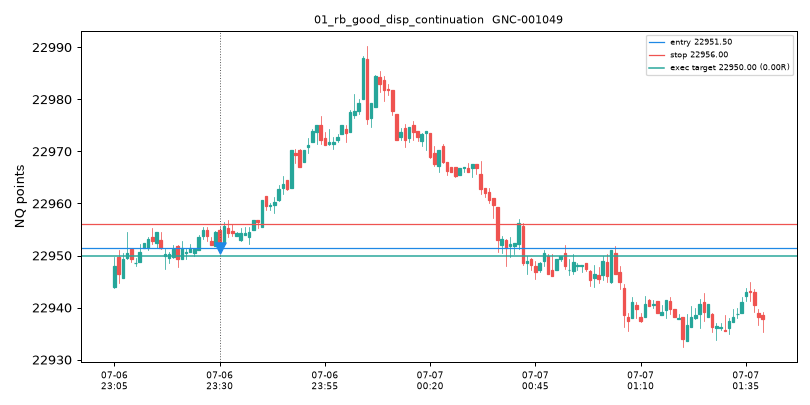

## 02_rb_bad_disp_unresolved
- branch_id: GBR-004321
- episode_id: GEP-000968
- hypothesis_id: H_rb_unresolved_fade
- terminal_status: UNRESOLVED
- terminal_reason: inactive
- ordered_event_ids: ['EVT-0048871', 'EVT-0048904', 'EVT-0050452']
- exact_graph_so_far: ['BEARISH_RB_CONFIRMED', 'BEARISH_RB_TAP', 'BAD_BULLISH_DISPLACEMENT']
- note: recorded UNRESOLVED branch: bad displacement then compression, no failure event -> not a setup

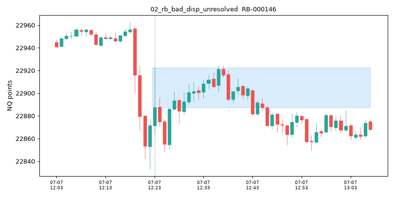

## 03_rb_bad_disp_failure_fade
- candidate_id: GNC-004484
- branch_id: GBR-004769
- episode_id: GEP-001068
- trigger_event_id: EVT-0054295
- branch_lineage_parents: ['GBR-004767']
- exact_graph: BULLISH_RB_CONFIRMED -> BULLISH_RB_TAP -> BAD_BEARISH_DISPLACEMENT -> COMPRESSION -> SWING_HIGH_BREAK -> FORMATION_CLOSE_SHORT_TRIGGER
- reduced_graph: STRUCTURAL_ZONE_INTERACTION -> WEAK_DISPLACEMENT -> COMPRESSION -> LEVEL_BREAK -> ENTRY_TRIGGER
- ordered_event_ids: ['EVT-0051805', 'EVT-0051835', 'EVT-0052588', 'EVT-0054279', 'EVT-0054295']
- ordered_transition_ids: ['H_rb_unresolved_fade:S0', 'H_rb_unresolved_fade:S1', 'H_rb_unresolved_fade:S2', 'H_rb_unresolved_fade:S3']
- relationship_evidence: ['BREAKS_BOUNDARY', 'DIRECTIONALLY_SUPPORTS', 'EXPANSION_LEAVES_COMPRESSION', 'TOUCHES_ZONE', 'WITHIN_SUPPORTING_ATR_PROXIMITY']
- timestamp_et: 2025-07-07 16:08:00-04:00
- direction: short
- entry_mode: formation_close
- trigger_family: rb_failure_fade
- continuation_or_fade: fade
- entry: 22857.5
- stop: 22864.25
- natural_target: 22857.0
- natural_rr: 0.0741
- executed_target: 22857.0
- executed_rr: 0.0
- expiry_rule: 120_bars_or_segment_end
- evidence_summary: None
- qualification: UNSCORED
- outcome_shown_separately: UNEVALUATED

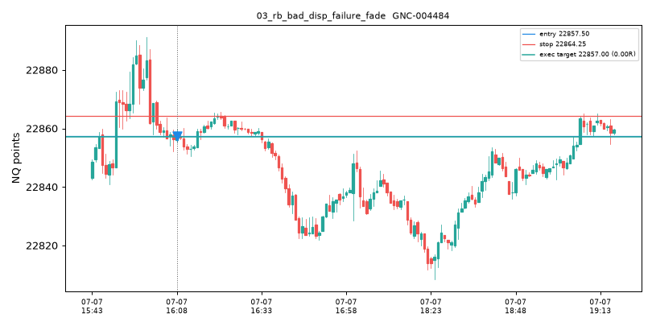

## 04_fvg_immediate_formation
- candidate_id: GNC-000001
- branch_id: GBR-000006
- episode_id: GEP-000003
- trigger_event_id: EVT-0000026
- branch_lineage_parents: []
- exact_graph: BEARISH_FVG_FORMED -> FORMATION_CLOSE_SHORT_TRIGGER
- reduced_graph: GAP_FORMATION -> ENTRY_TRIGGER
- ordered_event_ids: ['EVT-0000026']
- ordered_transition_ids: ['H_fvg_formation_close:S0']
- relationship_evidence: ['DIRECTIONALLY_SUPPORTS', 'ENTERS_ZONE', 'FILLS_ZONE', 'SAME_OBJECT', 'TOUCHES_ZONE']
- timestamp_et: 2025-07-06 18:10:00-04:00
- direction: short
- entry_mode: formation_close
- trigger_family: fvg_formation
- continuation_or_fade: continuation
- entry: 23000.0
- stop: 23006.25
- natural_target: 22977.0
- natural_rr: 3.68
- executed_target: 22993.75
- executed_rr: 1.0
- expiry_rule: 120_bars_or_segment_end
- evidence_summary: {'effective_sample': 0, 'unique_sessions': 0, 'shrunk_expected_R': 0.0, 'reduced_estimate': 0.0, 'exact_estimate': 0.0, 'uncertainty': 1.0, 'recency_ok': False}
- qualification: RECORDED_NOT_ACTIVATED
- outcome_shown_separately: WIN

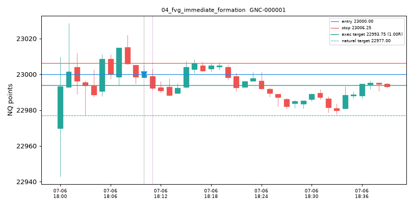

## 05_fvg_continuation_without_fill
- candidate_id: GNC-000001
- branch_id: GBR-000006
- episode_id: GEP-000003
- trigger_event_id: EVT-0000026
- branch_lineage_parents: []
- exact_graph: BEARISH_FVG_FORMED -> FORMATION_CLOSE_SHORT_TRIGGER
- reduced_graph: GAP_FORMATION -> ENTRY_TRIGGER
- ordered_event_ids: ['EVT-0000026']
- ordered_transition_ids: ['H_fvg_formation_close:S0']
- relationship_evidence: ['DIRECTIONALLY_SUPPORTS', 'ENTERS_ZONE', 'FILLS_ZONE', 'SAME_OBJECT', 'TOUCHES_ZONE']
- timestamp_et: 2025-07-06 18:10:00-04:00
- direction: short
- entry_mode: formation_close
- trigger_family: fvg_formation
- continuation_or_fade: continuation
- entry: 23000.0
- stop: 23006.25
- natural_target: 22977.0
- natural_rr: 3.68
- executed_target: 22993.75
- executed_rr: 1.0
- expiry_rule: 120_bars_or_segment_end
- evidence_summary: {'effective_sample': 0, 'unique_sessions': 0, 'shrunk_expected_R': 0.0, 'reduced_estimate': 0.0, 'exact_estimate': 0.0, 'uncertainty': 1.0, 'recency_ok': False}
- qualification: RECORDED_NOT_ACTIVATED
- outcome_shown_separately: WIN

## 06_fvg_first_touch
- candidate_id: GNC-000006
- branch_id: GBR-000016
- episode_id: GEP-000005
- trigger_event_id: EVT-0000035
- branch_lineage_parents: ['GBR-000014']
- exact_graph: BEARISH_FVG_FORMED -> BEARISH_FVG_FIRST_TOUCH -> FIRST_TOUCH_SHORT_TRIGGER
- reduced_graph: GAP_FORMATION -> GAP_FILL -> ENTRY_TRIGGER
- ordered_event_ids: ['EVT-0000031', 'EVT-0000035']
- ordered_transition_ids: ['H_fvg_first_touch:S0']
- relationship_evidence: ['DIRECTIONALLY_SUPPORTS', 'ENTERS_ZONE', 'FILLS_ZONE', 'SAME_OBJECT', 'TOUCHES_ZONE', 'WITHIN_FROZEN_TIME_GAP']
- timestamp_et: 2025-07-06 18:13:00-04:00
- direction: short
- entry_mode: first_touch
- trigger_family: fvg_fill
- continuation_or_fade: continuation
- entry: 22996.0
- stop: 22998.5
- natural_target: 22977.0
- natural_rr: 7.6
- executed_target: 22993.5
- executed_rr: 1.0
- expiry_rule: 120_bars_or_segment_end
- evidence_summary: {'effective_sample': 0, 'unique_sessions': 0, 'shrunk_expected_R': 0.0, 'reduced_estimate': 0.0, 'exact_estimate': 0.0, 'uncertainty': 1.0, 'recency_ok': False}
- qualification: RECORDED_NOT_ACTIVATED
- outcome_shown_separately: WIN

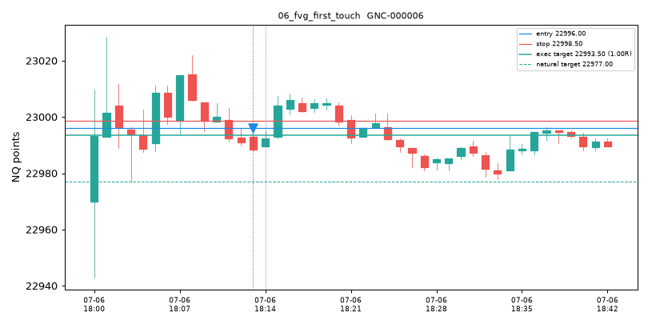

## 07_fvg_midpoint
- candidate_id: GNC-000008
- branch_id: GBR-000018
- episode_id: GEP-000005
- trigger_event_id: EVT-0000037
- branch_lineage_parents: ['GBR-000014']
- exact_graph: BEARISH_FVG_FORMED -> BEARISH_FVG_MIDPOINT -> MIDPOINT_SHORT_TRIGGER
- reduced_graph: GAP_FORMATION -> GAP_FILL -> ENTRY_TRIGGER
- ordered_event_ids: ['EVT-0000031', 'EVT-0000037']
- ordered_transition_ids: ['H_fvg_midpoint:S0']
- relationship_evidence: ['DIRECTIONALLY_SUPPORTS', 'ENTERS_ZONE', 'FILLS_ZONE', 'SAME_OBJECT', 'TOUCHES_ZONE', 'WITHIN_FROZEN_TIME_GAP']
- timestamp_et: 2025-07-06 18:13:00-04:00
- direction: short
- entry_mode: midpoint
- trigger_family: fvg_fill
- continuation_or_fade: continuation
- entry: 22997.0
- stop: 22998.5
- natural_target: 22977.0
- natural_rr: 13.3333
- executed_target: 22995.5
- executed_rr: 1.0
- expiry_rule: 120_bars_or_segment_end
- evidence_summary: {'effective_sample': 0, 'unique_sessions': 0, 'shrunk_expected_R': 0.0, 'reduced_estimate': 0.0, 'exact_estimate': 0.0, 'uncertainty': 1.0, 'recency_ok': False}
- qualification: RECORDED_NOT_ACTIVATED
- outcome_shown_separately: WIN

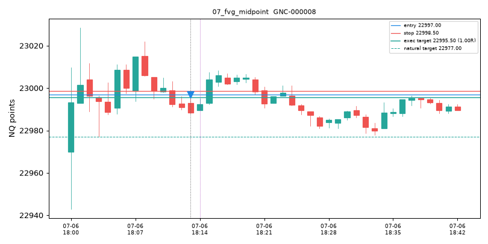

## 08_fvg_failure_ifvg_immediate
- candidate_id: GNC-000016
- branch_id: GBR-000022
- episode_id: GEP-000007
- trigger_event_id: EVT-0000053
- branch_lineage_parents: []
- exact_graph: BULLISH_IFVG_ACTIVATION -> FORMATION_CLOSE_LONG_TRIGGER
- reduced_graph: INVERSION_ACTIVATION -> ENTRY_TRIGGER
- ordered_event_ids: ['EVT-0000053']
- ordered_transition_ids: ['H_ifvg_immediate:S0']
- relationship_evidence: ['DIRECTIONALLY_SUPPORTS', 'ENTERS_ZONE', 'FILLS_ZONE', 'SAME_OBJECT', 'TOUCHES_ZONE', 'WITHIN_SUPPORTING_ATR_PROXIMITY']
- timestamp_et: 2025-07-06 18:15:00-04:00
- direction: long
- entry_mode: formation_close
- trigger_family: ifvg_activation
- continuation_or_fade: fade
- entry: 23004.0
- stop: 22992.0
- natural_target: 23022.0
- natural_rr: 1.5
- executed_target: 23016.0
- executed_rr: 1.0
- expiry_rule: 120_bars_or_segment_end
- evidence_summary: {'effective_sample': 0, 'unique_sessions': 0, 'shrunk_expected_R': 0.0, 'reduced_estimate': 0.0, 'exact_estimate': 0.0, 'uncertainty': 1.0, 'recency_ok': False}
- qualification: RECORDED_NOT_ACTIVATED
- outcome_shown_separately: LOSS

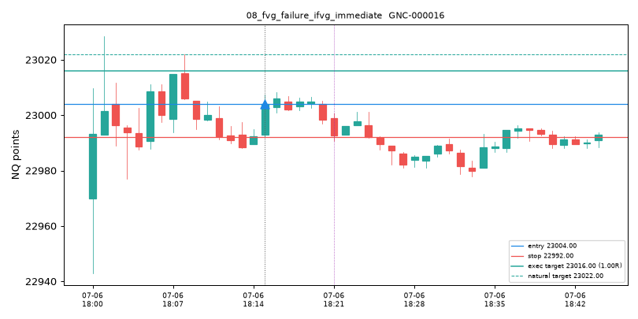

## 09_fvg_failure_ifvg_retest
- candidate_id: GNC-000025
- branch_id: GBR-000035
- episode_id: GEP-000010
- trigger_event_id: EVT-0000065
- branch_lineage_parents: ['GBR-000033']
- exact_graph: BULLISH_IFVG_ACTIVATION -> BULLISH_IFVG_FIRST_TOUCH -> RETEST_LONG_TRIGGER
- reduced_graph: INVERSION_ACTIVATION -> INVERSION_INTERACTION -> ENTRY_TRIGGER
- ordered_event_ids: ['EVT-0000061', 'EVT-0000065']
- ordered_transition_ids: ['H_ifvg_retest:S0']
- relationship_evidence: ['DIRECTIONALLY_SUPPORTS', 'ENTERS_ZONE', 'FILLS_ZONE', 'SAME_OBJECT', 'TOUCHES_ZONE', 'WITHIN_FROZEN_TIME_GAP', 'WITHIN_SUPPORTING_ATR_PROXIMITY']
- timestamp_et: 2025-07-06 18:17:00-04:00
- direction: long
- entry_mode: retest
- trigger_family: ifvg_retest
- continuation_or_fade: fade
- entry: 23005.75
- stop: 23001.25
- natural_target: 23022.0
- natural_rr: 3.6111
- executed_target: 23010.25
- executed_rr: 1.0
- expiry_rule: 120_bars_or_segment_end
- evidence_summary: {'effective_sample': 0, 'unique_sessions': 0, 'shrunk_expected_R': 0.0, 'reduced_estimate': 0.0, 'exact_estimate': 0.0, 'uncertainty': 1.0, 'recency_ok': False}
- qualification: RECORDED_NOT_ACTIVATED
- outcome_shown_separately: LOSS

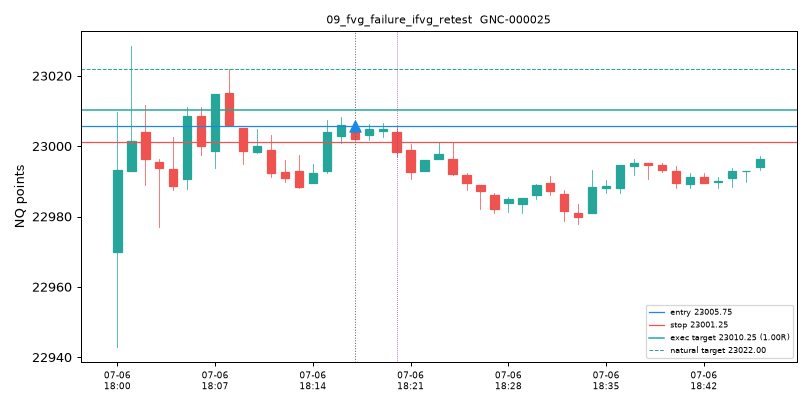

## 10_sweep_reclaim_fade
- candidate_id: GNC-000054
- branch_id: GBR-000065
- episode_id: GEP-000009
- trigger_event_id: EVT-0000115
- branch_lineage_parents: ['GBR-000031']
- exact_graph: SWING_LOW_SWEEP_BELOW -> SWING_LOW_RECLAIM -> FORMATION_CLOSE_LONG_TRIGGER
- reduced_graph: LIQUIDITY_SWEEP -> RECLAIM -> ENTRY_TRIGGER
- ordered_event_ids: ['EVT-0000112', 'EVT-0000115']
- ordered_transition_ids: ['H_liquidity_sweep_reclaim_fade:S0']
- relationship_evidence: ['DIRECTIONALLY_SUPPORTS', 'RECLAIMS_BOUNDARY', 'WITHIN_SUPPORTING_ATR_PROXIMITY']
- timestamp_et: 2025-07-06 18:25:00-04:00
- direction: long
- entry_mode: formation_close
- trigger_family: sweep_reclaim_fade
- continuation_or_fade: fade
- entry: 22989.5
- stop: 22987.0
- natural_target: 22990.75
- natural_rr: 0.5
- executed_target: 22990.75
- executed_rr: 0.5
- expiry_rule: 120_bars_or_segment_end
- evidence_summary: {'effective_sample': 0, 'unique_sessions': 0, 'shrunk_expected_R': 0.0, 'reduced_estimate': 0.0, 'exact_estimate': 0.0, 'uncertainty': 1.0, 'recency_ok': False}
- qualification: RECORDED_NOT_ACTIVATED
- outcome_shown_separately: LOSS

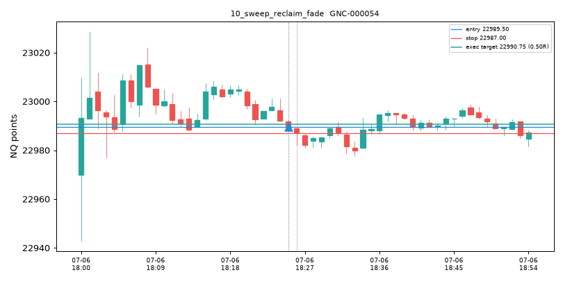

## 11_sweep_acceptance_continuation
- candidate_id: GNC-000111
- branch_id: GBR-000116
- episode_id: GEP-000028
- trigger_event_id: EVT-0000221
- branch_lineage_parents: ['GBR-000114']
- exact_graph: SWING_HIGH_SWEEP_ABOVE -> SWING_LOW_ACCEPTANCE_ABOVE -> FORMATION_CLOSE_LONG_TRIGGER
- reduced_graph: LIQUIDITY_SWEEP -> ACCEPTANCE -> ENTRY_TRIGGER
- ordered_event_ids: ['EVT-0000209', 'EVT-0000221']
- ordered_transition_ids: ['H_liquidity_sweep_accept_continuation:S0']
- relationship_evidence: ['ACCEPTS_BEYOND_BOUNDARY', 'DIRECTIONALLY_SUPPORTS', 'WITHIN_FROZEN_TIME_GAP', 'WITHIN_SUPPORTING_ATR_PROXIMITY']
- timestamp_et: 2025-07-06 18:35:00-04:00
- direction: long
- entry_mode: formation_close
- trigger_family: sweep_accept_cont
- continuation_or_fade: continuation
- entry: 22988.75
- stop: 22986.25
- natural_target: 22990.75
- natural_rr: 0.8
- executed_target: 22990.75
- executed_rr: 0.8
- expiry_rule: 120_bars_or_segment_end
- evidence_summary: {'effective_sample': 0, 'unique_sessions': 0, 'shrunk_expected_R': 0.0, 'reduced_estimate': 0.0, 'exact_estimate': 0.0, 'uncertainty': 1.0, 'recency_ok': False}
- qualification: RECORDED_NOT_ACTIVATED
- outcome_shown_separately: WIN

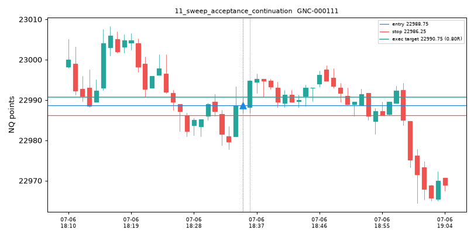

## 12_time_anchor_reclaim_no_fvg
- candidate_id: GNC-000414
- branch_id: GBR-000457
- episode_id: GEP-000105
- trigger_event_id: EVT-0001950
- branch_lineage_parents: ['GBR-000443']
- exact_graph: ANCHOR_ASIA_OPEN_RECLAIM -> FORMATION_CLOSE_LONG_TRIGGER
- reduced_graph: RECLAIM -> ENTRY_TRIGGER
- ordered_event_ids: ['EVT-0001950']
- ordered_transition_ids: ['H_anchor_reclaim_continuation:S0']
- relationship_evidence: ['DIRECTIONALLY_SUPPORTS', 'RECLAIMS_BOUNDARY', 'SAME_OBJECT', 'TIME_ANCHOR_INTERACTION', 'WITHIN_SUPPORTING_ATR_PROXIMITY']
- timestamp_et: 2025-07-06 20:02:00-04:00
- direction: long
- entry_mode: formation_close
- trigger_family: anchor_reclaim
- continuation_or_fade: continuation
- entry: 22986.75
- stop: 22981.75
- natural_target: 22987.75
- natural_rr: 0.2
- executed_target: 22987.75
- executed_rr: 0.0
- expiry_rule: 120_bars_or_segment_end
- evidence_summary: None
- qualification: UNSCORED
- outcome_shown_separately: UNEVALUATED

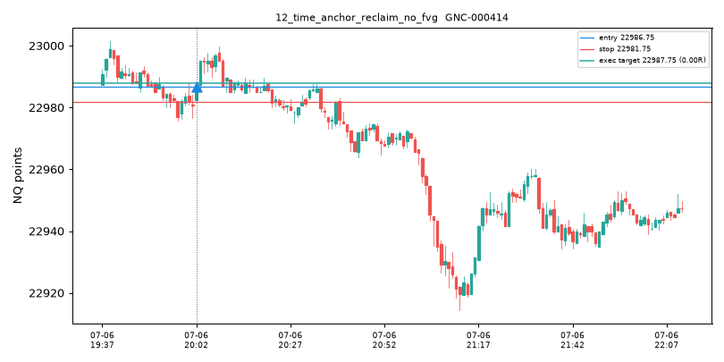

## 13_time_anchor_rejection_fade
- candidate_id: GNC-001127
- branch_id: GBR-001284
- episode_id: GEP-000307
- trigger_event_id: EVT-0005958
- branch_lineage_parents: ['GBR-001283']
- exact_graph: ANCHOR_MIDNIGHT_OPEN_BREAK -> SWING_LOW_RECLAIM -> FORMATION_CLOSE_SHORT_TRIGGER
- reduced_graph: LEVEL_BREAK -> RECLAIM -> ENTRY_TRIGGER
- ordered_event_ids: ['EVT-0005956', 'EVT-0005958']
- ordered_transition_ids: ['H_time_anchor_break_failed_fade:S0']
- relationship_evidence: ['DIRECTIONALLY_SUPPORTS', 'RECLAIMS_BOUNDARY', 'WITHIN_SUPPORTING_ATR_PROXIMITY']
- timestamp_et: 2025-07-07 00:01:00-04:00
- direction: short
- entry_mode: formation_close
- trigger_family: break_failed_fade
- continuation_or_fade: fade
- entry: 22977.5
- stop: 22978.5
- natural_target: 22977.0
- natural_rr: 0.5
- executed_target: 22977.0
- executed_rr: 0.5
- expiry_rule: 120_bars_or_segment_end
- evidence_summary: {'effective_sample': 0, 'unique_sessions': 0, 'shrunk_expected_R': 0.0736, 'reduced_estimate': 0.0736, 'exact_estimate': 0.0736, 'uncertainty': 1.0, 'recency_ok': False}
- qualification: RECORDED_NOT_ACTIVATED
- outcome_shown_separately: AMBIGUOUS

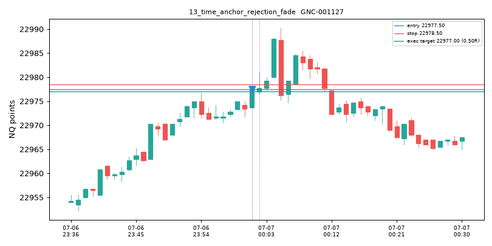

## 14_vwap_continuation
- candidate_id: GNC-001124
- branch_id: GBR-001278
- episode_id: GEP-000305
- trigger_event_id: EVT-0005943
- branch_lineage_parents: []
- exact_graph: VWAP_VWAP_BOUNCE_UP -> FIRST_TOUCH_LONG_TRIGGER
- reduced_graph: VWAP_INTERACTION -> ENTRY_TRIGGER
- ordered_event_ids: ['EVT-0005943']
- ordered_transition_ids: ['H_vwap_bounce_continuation:S0']
- relationship_evidence: ['DIRECTIONALLY_SUPPORTS', 'ENTERS_ZONE', 'FILLS_ZONE', 'REJECTS_BOUNDARY', 'SAME_OBJECT', 'TOUCHES_ZONE', 'WITHIN_SUPPORTING_ATR_PROXIMITY']
- timestamp_et: 2025-07-07 00:00:00-04:00
- direction: long
- entry_mode: first_touch
- trigger_family: vwap_bounce
- continuation_or_fade: continuation
- entry: 22973.416666666668
- stop: 22971.25
- natural_target: 22974.25
- natural_rr: 0.3846
- executed_target: 22974.25
- executed_rr: 0.0
- expiry_rule: 120_bars_or_segment_end
- evidence_summary: None
- qualification: UNSCORED
- outcome_shown_separately: UNEVALUATED

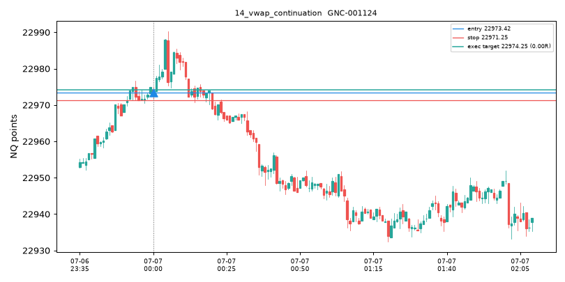

## 15_vwap_fade
- candidate_id: GNC-001125
- branch_id: GBR-001279
- episode_id: GEP-000305
- trigger_event_id: EVT-0005944
- branch_lineage_parents: ['GBR-001278']
- exact_graph: VWAP_BAND_REJECT_M1_618 -> FORMATION_CLOSE_LONG_TRIGGER
- reduced_graph: BAND_REJECTION -> ENTRY_TRIGGER
- ordered_event_ids: ['EVT-0005944']
- ordered_transition_ids: ['H_vwap_band_fade:S0']
- relationship_evidence: ['DIRECTIONALLY_SUPPORTS', 'ENTERS_ZONE', 'FILLS_ZONE', 'REJECTS_BOUNDARY', 'SAME_OBJECT', 'TOUCHES_ZONE', 'WITHIN_SUPPORTING_ATR_PROXIMITY']
- timestamp_et: 2025-07-07 00:00:00-04:00
- direction: long
- entry_mode: formation_close
- trigger_family: vwap_band_fade
- continuation_or_fade: fade
- entry: 22973.5
- stop: 22971.25
- natural_target: 22974.25
- natural_rr: 0.3333
- executed_target: 22974.25
- executed_rr: 0.0
- expiry_rule: 120_bars_or_segment_end
- evidence_summary: None
- qualification: UNSCORED
- outcome_shown_separately: UNEVALUATED

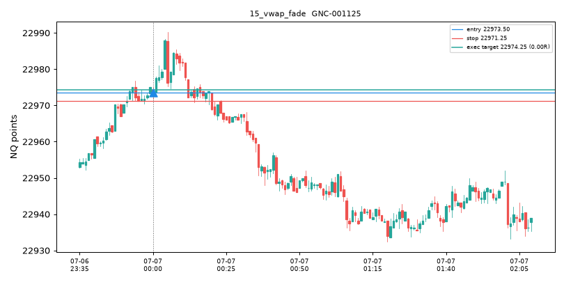

## 16_compression_expansion
- candidate_id: GNC-000020
- branch_id: GBR-000020
- episode_id: GEP-000006
- trigger_event_id: EVT-0000058
- branch_lineage_parents: []
- exact_graph: COMPRESSION -> STRUCT_BREAK -> NEXT_BAR_LONG_TRIGGER
- reduced_graph: COMPRESSION -> LEVEL_BREAK -> ENTRY_TRIGGER
- ordered_event_ids: ['EVT-0000041', 'EVT-0000058']
- ordered_transition_ids: ['H_compression_expansion:S0']
- relationship_evidence: ['BREAKS_BOUNDARY', 'DIRECTIONALLY_SUPPORTS', 'ENTERS_ZONE', 'EXPANSION_LEAVES_COMPRESSION', 'FILLS_ZONE', 'SAME_OBJECT', 'TOUCHES_ZONE', 'WITHIN_FROZEN_TIME_GAP', 'WITHIN_SUPPORTING_ATR_PROXIMITY']
- timestamp_et: 2025-07-06 18:17:00-04:00
- direction: long
- entry_mode: next_bar
- trigger_family: compression_expansion
- continuation_or_fade: continuation
- entry: 23005.0
- stop: 22987.75
- natural_target: 23022.0
- natural_rr: 0.9855
- executed_target: 23022.0
- executed_rr: 0.9855
- expiry_rule: 120_bars_or_segment_end
- evidence_summary: {'effective_sample': 0, 'unique_sessions': 0, 'shrunk_expected_R': 0.0, 'reduced_estimate': 0.0, 'exact_estimate': 0.0, 'uncertainty': 1.0, 'recency_ok': False}
- qualification: RECORDED_NOT_ACTIVATED
- outcome_shown_separately: LOSS

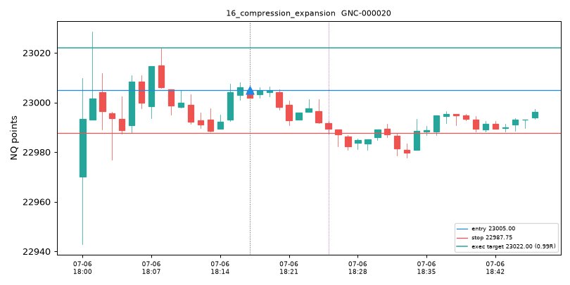

## 17_false_expansion_fade
- candidate_id: GNC-000024
- branch_id: GBR-000021
- episode_id: GEP-000006
- trigger_event_id: EVT-0000062
- branch_lineage_parents: ['GBR-000020']
- exact_graph: COMPRESSION -> STRUCT_FAILED_CONTINUATION -> FORMATION_CLOSE_SHORT_TRIGGER
- reduced_graph: COMPRESSION -> STRUCTURAL_EVENT -> ENTRY_TRIGGER
- ordered_event_ids: ['EVT-0000041', 'EVT-0000062']
- ordered_transition_ids: ['H_compression_false_expansion_fade:S0']
- relationship_evidence: ['DIRECTIONALLY_SUPPORTS', 'ENTERS_ZONE', 'FAILED_EXPANSION_RETURNS_TO_REGION', 'FILLS_ZONE', 'SAME_OBJECT', 'TOUCHES_ZONE', 'WITHIN_FROZEN_TIME_GAP', 'WITHIN_SUPPORTING_ATR_PROXIMITY']
- timestamp_et: 2025-07-06 18:17:00-04:00
- direction: short
- entry_mode: formation_close
- trigger_family: compression_false_expansion
- continuation_or_fade: fade
- entry: 23002.0
- stop: 23007.5
- natural_target: 22988.25
- natural_rr: 2.5
- executed_target: 22996.5
- executed_rr: 1.0
- expiry_rule: 120_bars_or_segment_end
- evidence_summary: {'effective_sample': 0, 'unique_sessions': 0, 'shrunk_expected_R': 0.0, 'reduced_estimate': 0.0, 'exact_estimate': 0.0, 'uncertainty': 1.0, 'recency_ok': False}
- qualification: RECORDED_NOT_ACTIVATED
- outcome_shown_separately: WIN

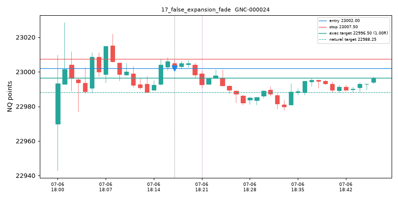

## 18_one_event_advances_multiple_branches
- event_id: EVT-0000026
- advanced_branch_ids: ['GBR-000006', 'GBR-000007']
- note: one event advanced multiple compatible branches

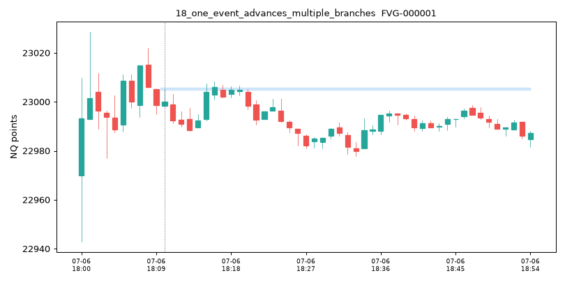

## 19_unrelated_event_rejected
- rb_branch_id: GBR-001302
- rb_object: RB-000047
- rejected_event_id: EVT-0006387
- rejected_event_subtype: VWAP_VWAP_ABOVE
- relationships_satisfied: ['WITHIN_FROZEN_TIME_GAP', 'WITHIN_SUPPORTING_ATR_PROXIMITY']
- reason: within ATR proximity but no structural edge -> rejected (price proximity alone is not a causal edge)

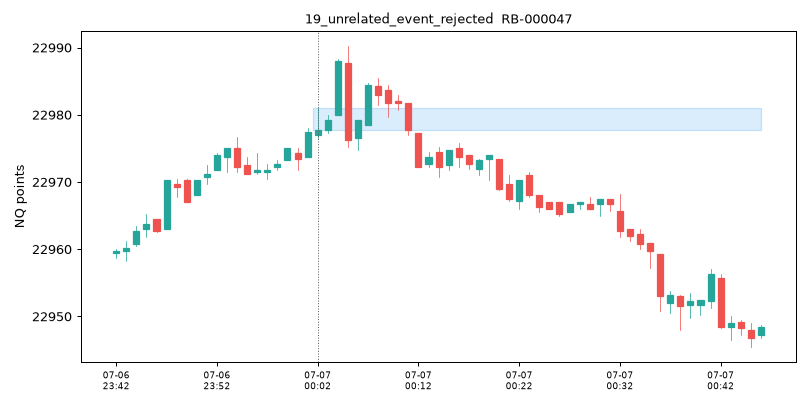

## 20_graph_native_not_in_static
- candidate_id: GNC-001049
- branch_id: GBR-001134
- episode_id: GEP-000269
- trigger_event_id: EVT-0005294
- branch_lineage_parents: []
- exact_graph: BEARISH_RB_CONFIRMED -> BEARISH_RB_TAP -> GOOD_BEARISH_DISPLACEMENT -> FORMATION_CLOSE_SHORT_TRIGGER
- reduced_graph: STRUCTURAL_ZONE_INTERACTION -> STRONG_DISPLACEMENT -> ENTRY_TRIGGER
- ordered_event_ids: ['EVT-0005033', 'EVT-0005183', 'EVT-0005294']
- ordered_transition_ids: ['H_rb_reaction_continuation:S0', 'H_rb_reaction_continuation:S1']
- relationship_evidence: ['DIRECTIONALLY_SUPPORTS', 'DISPLACEMENT_ORIGINATES_AT_OBJECT', 'ENTERS_ZONE', 'FILLS_ZONE', 'TOUCHES_ZONE', 'WITHIN_FROZEN_TIME_GAP', 'WITHIN_SUPPORTING_ATR_PROXIMITY']
- timestamp_et: 2025-07-06 23:30:00-04:00
- direction: short
- entry_mode: formation_close
- trigger_family: rb_reaction
- continuation_or_fade: continuation
- entry: 22951.5
- stop: 22956.0
- natural_target: 22950.0
- natural_rr: 0.3333
- executed_target: 22950.0
- executed_rr: 0.0
- expiry_rule: 120_bars_or_segment_end
- evidence_summary: None
- qualification: UNSCORED
- outcome_shown_separately: UNEVALUATED

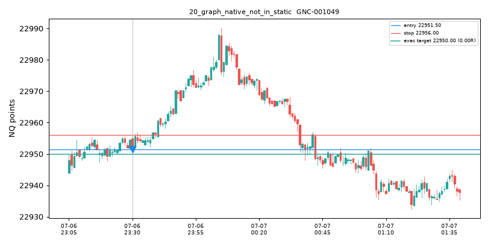

## 21_rejected_below_half_R
- candidate_id: GNC-000005
- branch_id: GBR-000012
- episode_id: GEP-000004
- trigger_event_id: EVT-0000032
- branch_lineage_parents: []
- exact_graph: SWING_HIGH_BREAK -> SWING_HIGH_ACCEPTANCE_BELOW -> FORMATION_CLOSE_SHORT_TRIGGER
- reduced_graph: LEVEL_BREAK -> ACCEPTANCE -> ENTRY_TRIGGER
- ordered_event_ids: ['EVT-0000028', 'EVT-0000032']
- ordered_transition_ids: ['H_liquidity_break_accept_continuation:S0']
- relationship_evidence: ['ACCEPTS_BEYOND_BOUNDARY', 'DIRECTIONALLY_SUPPORTS', 'SAME_OBJECT', 'WITHIN_FROZEN_TIME_GAP']
- timestamp_et: 2025-07-06 18:12:00-04:00
- direction: short
- entry_mode: formation_close
- trigger_family: break_accept_cont
- continuation_or_fade: continuation
- entry: 22991.0
- stop: 23022.5
- natural_target: 22977.0
- natural_rr: 0.4444
- executed_target: 22977.0
- executed_rr: 0.0
- expiry_rule: 120_bars_or_segment_end
- evidence_summary: None
- qualification: UNSCORED
- outcome_shown_separately: UNEVALUATED

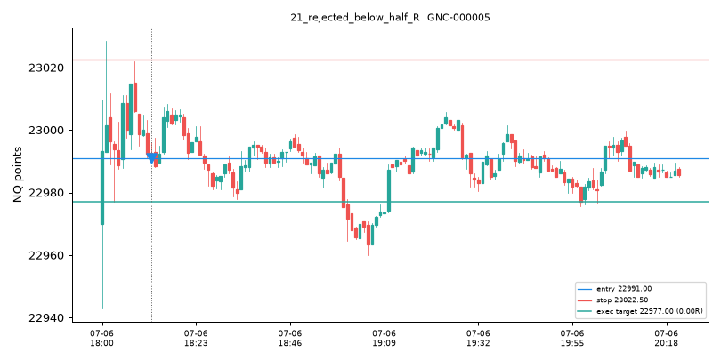

## 22_natural_half_to_1R
- candidate_id: GNC-000013
- branch_id: GBR-000019
- episode_id: GEP-000005
- trigger_event_id: EVT-0000047
- branch_lineage_parents: ['GBR-000014']
- exact_graph: BEARISH_FVG_FORMED -> BEARISH_FVG_FULL_FILL -> FULL_FILL_SHORT_TRIGGER
- reduced_graph: GAP_FORMATION -> GAP_FILL -> ENTRY_TRIGGER
- ordered_event_ids: ['EVT-0000031', 'EVT-0000047']
- ordered_transition_ids: ['H_fvg_full_fill:S0']
- relationship_evidence: ['DIRECTIONALLY_SUPPORTS', 'ENTERS_ZONE', 'FILLS_ZONE', 'SAME_OBJECT', 'TOUCHES_ZONE', 'WITHIN_FROZEN_TIME_GAP', 'WITHIN_SUPPORTING_ATR_PROXIMITY']
- timestamp_et: 2025-07-06 18:15:00-04:00
- direction: short
- entry_mode: full_fill
- trigger_family: fvg_fill
- continuation_or_fade: continuation
- entry: 22998.0
- stop: 23008.0
- natural_target: 22988.25
- natural_rr: 0.975
- executed_target: 22988.25
- executed_rr: 0.975
- expiry_rule: 120_bars_or_segment_end
- evidence_summary: {'effective_sample': 0, 'unique_sessions': 0, 'shrunk_expected_R': 0.0, 'reduced_estimate': 0.0, 'exact_estimate': 0.0, 'uncertainty': 1.0, 'recency_ok': False}
- qualification: RECORDED_NOT_ACTIVATED
- outcome_shown_separately: LOSS

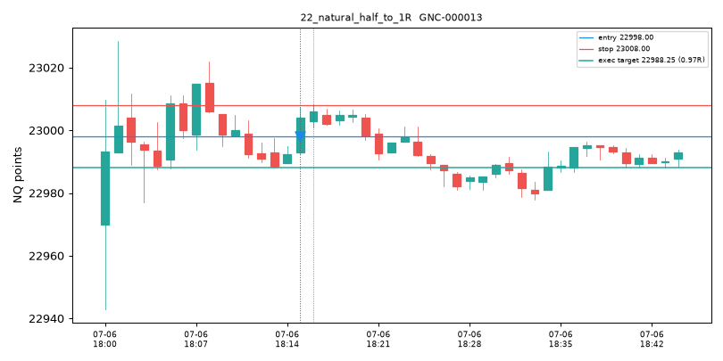

## 23_capped_1R
- candidate_id: GNC-000001
- branch_id: GBR-000006
- episode_id: GEP-000003
- trigger_event_id: EVT-0000026
- branch_lineage_parents: []
- exact_graph: BEARISH_FVG_FORMED -> FORMATION_CLOSE_SHORT_TRIGGER
- reduced_graph: GAP_FORMATION -> ENTRY_TRIGGER
- ordered_event_ids: ['EVT-0000026']
- ordered_transition_ids: ['H_fvg_formation_close:S0']
- relationship_evidence: ['DIRECTIONALLY_SUPPORTS', 'ENTERS_ZONE', 'FILLS_ZONE', 'SAME_OBJECT', 'TOUCHES_ZONE']
- timestamp_et: 2025-07-06 18:10:00-04:00
- direction: short
- entry_mode: formation_close
- trigger_family: fvg_formation
- continuation_or_fade: continuation
- entry: 23000.0
- stop: 23006.25
- natural_target: 22977.0
- natural_rr: 3.68
- executed_target: 22993.75
- executed_rr: 1.0
- expiry_rule: 120_bars_or_segment_end
- evidence_summary: {'effective_sample': 0, 'unique_sessions': 0, 'shrunk_expected_R': 0.0, 'reduced_estimate': 0.0, 'exact_estimate': 0.0, 'uncertainty': 1.0, 'recency_ok': False}
- qualification: RECORDED_NOT_ACTIVATED
- outcome_shown_separately: WIN

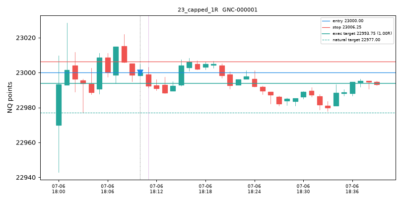

## 24_sufficient_prior_evidence
- candidate_id: GNC-009499
- branch_id: GBR-010547
- episode_id: GEP-002358
- trigger_event_id: EVT-0157595
- branch_lineage_parents: ['GBR-010546']
- exact_graph: BEARISH_FVG_FORMED -> NEXT_BAR_SHORT_TRIGGER
- reduced_graph: GAP_FORMATION -> ENTRY_TRIGGER
- ordered_event_ids: ['EVT-0157595']
- ordered_transition_ids: ['H_fvg_next_bar:S0']
- relationship_evidence: ['DIRECTIONALLY_SUPPORTS', 'ENTERS_ZONE', 'FILLS_ZONE', 'SAME_OBJECT', 'TOUCHES_ZONE', 'WITHIN_SUPPORTING_ATR_PROXIMITY']
- timestamp_et: 2025-07-08 18:10:00-04:00
- direction: short
- entry_mode: next_bar
- trigger_family: fvg_formation
- continuation_or_fade: continuation
- entry: 22916.0
- stop: 22916.25
- natural_target: 22915.5
- natural_rr: 2.0
- executed_target: 22915.75
- executed_rr: 1.0
- expiry_rule: 120_bars_or_segment_end
- evidence_summary: {'effective_sample': 4, 'unique_sessions': 4, 'shrunk_expected_R': 0.1123, 'reduced_estimate': 0.1405, 'exact_estimate': 0.1123, 'uncertainty': 0.4577, 'recency_ok': True}
- qualification: QUALIFIED_PENDING_TRIGGER
- outcome_shown_separately: AMBIGUOUS

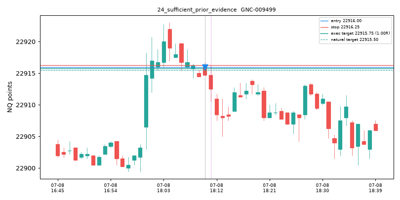

## 25_recorded_not_activated
- candidate_id: GNC-000001
- branch_id: GBR-000006
- episode_id: GEP-000003
- trigger_event_id: EVT-0000026
- branch_lineage_parents: []
- exact_graph: BEARISH_FVG_FORMED -> FORMATION_CLOSE_SHORT_TRIGGER
- reduced_graph: GAP_FORMATION -> ENTRY_TRIGGER
- ordered_event_ids: ['EVT-0000026']
- ordered_transition_ids: ['H_fvg_formation_close:S0']
- relationship_evidence: ['DIRECTIONALLY_SUPPORTS', 'ENTERS_ZONE', 'FILLS_ZONE', 'SAME_OBJECT', 'TOUCHES_ZONE']
- timestamp_et: 2025-07-06 18:10:00-04:00
- direction: short
- entry_mode: formation_close
- trigger_family: fvg_formation
- continuation_or_fade: continuation
- entry: 23000.0
- stop: 23006.25
- natural_target: 22977.0
- natural_rr: 3.68
- executed_target: 22993.75
- executed_rr: 1.0
- expiry_rule: 120_bars_or_segment_end
- evidence_summary: {'effective_sample': 0, 'unique_sessions': 0, 'shrunk_expected_R': 0.0, 'reduced_estimate': 0.0, 'exact_estimate': 0.0, 'uncertainty': 1.0, 'recency_ok': False}
- qualification: RECORDED_NOT_ACTIVATED
- outcome_shown_separately: WIN

