# Multi-Timeframe Target Layer — Development Audit Pack

Window: 2025-07-06T00:00Z .. 2025-07-11T23:59:59Z (NQU5, end-exclusive 2025-07-12). Development (contaminated) data only — no edge or forward claim. Examples selected chronologically, never by profit. Outcome is shown separately from selection.

## 01_high_5m_upper_wick
- object_id: WICK5-000246
- timeframe: 5
- side: upper
- prominence_score: 83.22
- grade: HIGH
- full_zone: [22983.5, 22990.0]
- exposed_5: (22985.5, 22990.0)
- proximal: 22983.5
- extreme: 22990.0
- available_seq: 760
- first_touch_seq: 836
- positive_overlap_seq: 847
- swept_seq: 847
- closed_through_seq: 847
- final_state: closed_through
- metrics: {'wick': 6.5, 'wick_atr': 0.5742, 'wick_range': 0.4483, 'wick_body': 0.8125, 'range_atr': 1.281, 'close_loc': 0.0, 'exposed_prot_atr': 0.3976, 'wick_atr_pct': 0.975, 'range_atr_pct': 0.775, 'exposed_pct': 0.975}

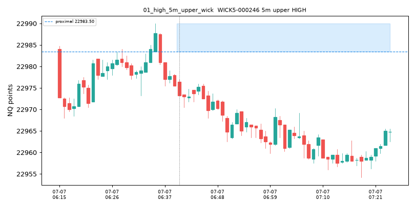

## 02_high_5m_lower_wick
- object_id: WICK5-000032
- timeframe: 5
- side: lower
- prominence_score: 83.06
- grade: HIGH
- full_zone: [22973.25, 22981.75]
- exposed_5: (22973.25, 22975.0)
- proximal: 22981.75
- extreme: 22973.25
- available_seq: 160
- first_touch_seq: 160
- positive_overlap_seq: 160
- swept_seq: 162
- closed_through_seq: 162
- final_state: closed_through
- metrics: {'wick': 8.5, 'wick_atr': 0.7187, 'wick_range': 0.6296, 'wick_body': 1.8889, 'range_atr': 1.1414, 'close_loc': 0.6296, 'exposed_prot_atr': 0.148, 'wick_atr_pct': 0.9333, 'range_atr_pct': 0.875, 'exposed_pct': 0.9333}

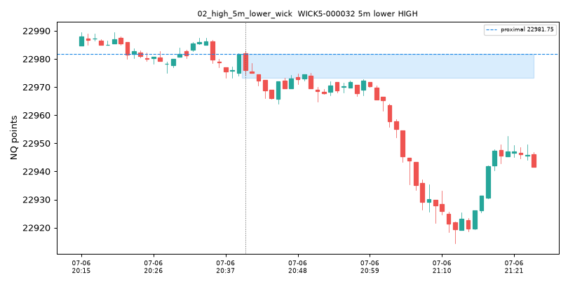

## 03_15m_prominent_wick
- object_id: WICK15-000008
- timeframe: 15
- side: lower
- prominence_score: 68.95
- grade: MEDIUM
- full_zone: [22940.75, 22955.75]
- exposed_5: None
- proximal: 22955.75
- extreme: 22940.75
- available_seq: 285
- first_touch_seq: 285
- positive_overlap_seq: 285
- swept_seq: 426
- closed_through_seq: 426
- final_state: closed_through
- metrics: {'wick': 15.0, 'wick_atr': 0.6261, 'wick_range': 0.6316, 'wick_body': 2.0, 'range_atr': 0.9912, 'close_loc': 0.6316, 'exposed_prot_atr': 0.0, 'wick_atr_pct': 1.0, 'range_atr_pct': 1.0, 'exposed_pct': 0.0}

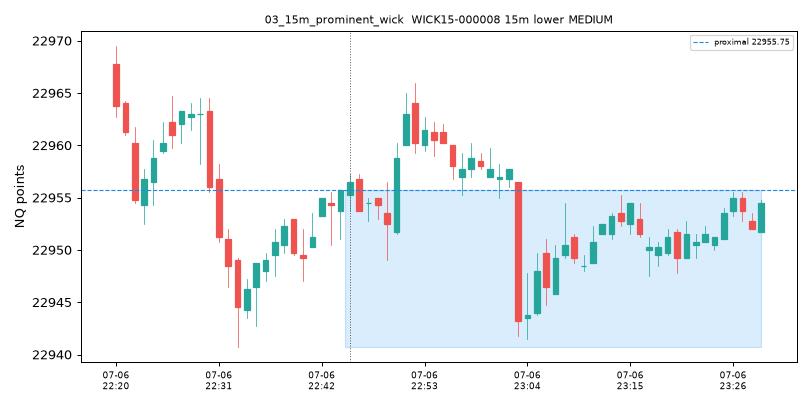

## 04_30m_prominent_wick
- object_id: WICK30-000004
- timeframe: 30
- side: lower
- prominence_score: 82.57
- grade: HIGH
- full_zone: [22918.0, 22932.25]
- exposed_5: (22918.0, 22932.25)
- proximal: 22932.25
- extreme: 22918.0
- available_seq: 510
- first_touch_seq: 510
- positive_overlap_seq: 510
- swept_seq: 610
- closed_through_seq: 610
- final_state: closed_through
- metrics: {'wick': 14.25, 'wick_atr': 0.5232, 'wick_range': 0.4191, 'wick_body': 0.8507, 'range_atr': 1.2483, 'close_loc': 0.4191, 'exposed_prot_atr': 0.5232, 'wick_atr_pct': 1.0, 'range_atr_pct': 1.0, 'exposed_pct': 1.0}

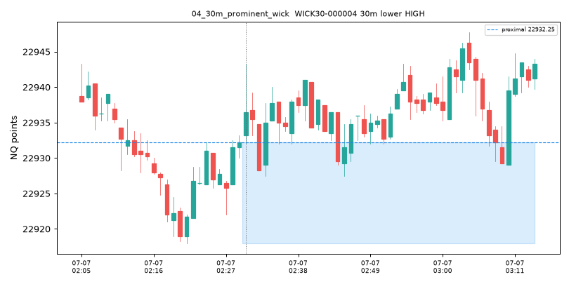

## 05_60m_prominent_wick
- object_id: WICK60-000008
- timeframe: 60
- side: lower
- prominence_score: 68.6
- grade: MEDIUM
- full_zone: [22833.5, 22870.5]
- exposed_5: (22833.5, 22870.5)
- proximal: 22870.5
- extreme: 22833.5
- available_seq: 1140
- first_touch_seq: 1140
- positive_overlap_seq: 1140
- swept_seq: 1216
- closed_through_seq: 1219
- final_state: closed_through
- metrics: {'wick': 37.0, 'wick_atr': 0.8247, 'wick_range': 0.2868, 'wick_body': 0.6379, 'range_atr': 2.8753, 'close_loc': 0.2868, 'exposed_prot_atr': 0.8247, 'wick_atr_pct': 0.6667, 'range_atr_pct': 1.0, 'exposed_pct': 1.0}

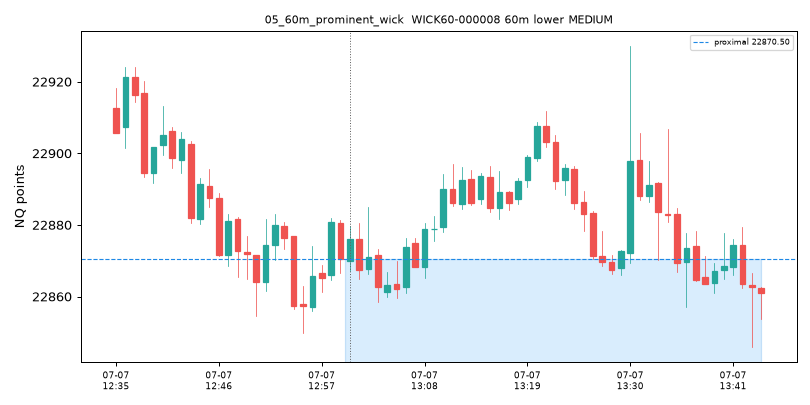

## 06_exposed_wick_no_prior_overlap
- object_id: WICK5-000017
- timeframe: 5
- side: lower
- prominence_score: 73.89
- grade: MEDIUM
- full_zone: [22975.75, 22983.5]
- exposed_5: (22975.75, 22980.0)
- proximal: 22983.5
- extreme: 22975.75
- available_seq: 120
- first_touch_seq: 120
- positive_overlap_seq: 121
- swept_seq: 148
- closed_through_seq: 157
- final_state: closed_through
- metrics: {'wick': 7.75, 'wick_atr': 0.5543, 'wick_range': 0.8378, 'wick_body': 7.75, 'range_atr': 0.6616, 'close_loc': 0.8378, 'exposed_prot_atr': 0.304, 'wick_atr_pct': 0.875, 'range_atr_pct': 0.125, 'exposed_pct': 1.0}

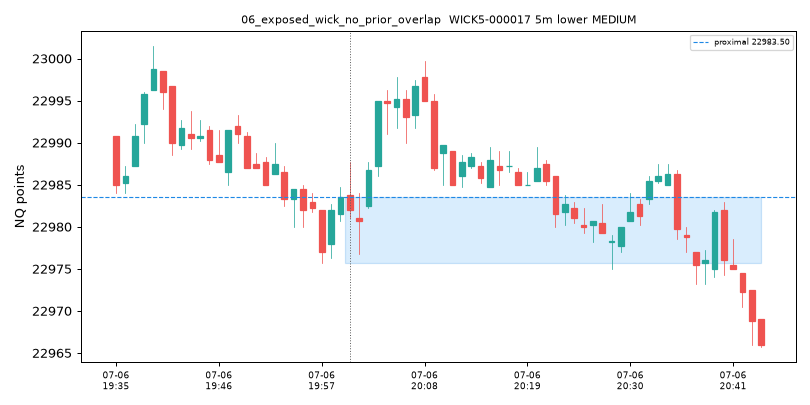

## 07_wick_invalidated_by_later_overlap
- object_id: WICK60-000012
- timeframe: 60
- side: lower
- prominence_score: 85.71
- grade: HIGH
- full_zone: [22779.75, 22871.5]
- exposed_5: (22779.75, 22833.5)
- proximal: 22871.5
- extreme: 22779.75
- available_seq: 1260
- first_touch_seq: 1262
- positive_overlap_seq: 1361
- swept_seq: None
- closed_through_seq: None
- final_state: overlapped
- metrics: {'wick': 91.75, 'wick_atr': 1.7233, 'wick_range': 0.9039, 'wick_body': 15.2917, 'range_atr': 1.9064, 'close_loc': 0.9631, 'exposed_prot_atr': 1.0096, 'wick_atr_pct': 1.0, 'range_atr_pct': 0.4, 'exposed_pct': 1.0}

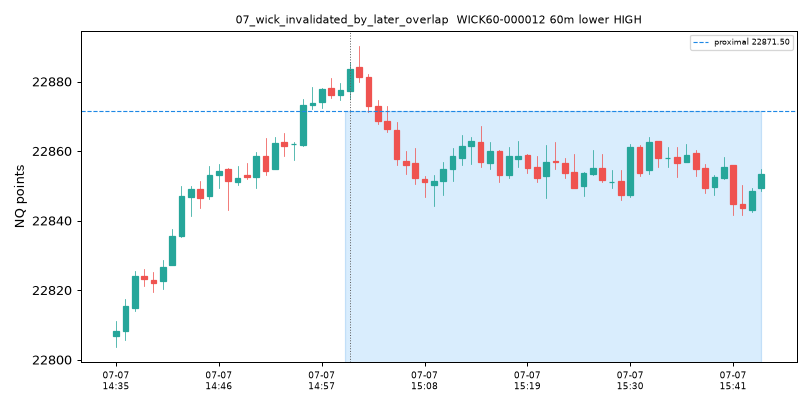

## 08_wick_consumed_by_sweep
- object_id: WICK5-000017
- timeframe: 5
- side: lower
- prominence_score: 73.89
- grade: MEDIUM
- full_zone: [22975.75, 22983.5]
- exposed_5: (22975.75, 22980.0)
- proximal: 22983.5
- extreme: 22975.75
- available_seq: 120
- first_touch_seq: 120
- positive_overlap_seq: 121
- swept_seq: 148
- closed_through_seq: 157
- final_state: closed_through
- metrics: {'wick': 7.75, 'wick_atr': 0.5543, 'wick_range': 0.8378, 'wick_body': 7.75, 'range_atr': 0.6616, 'close_loc': 0.8378, 'exposed_prot_atr': 0.304, 'wick_atr_pct': 0.875, 'range_atr_pct': 0.125, 'exposed_pct': 1.0}

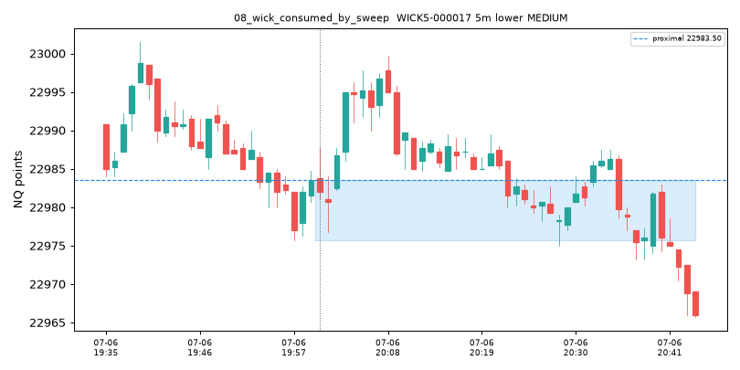

## 09_fresh_5m_fvg_target
- object_id: HTFFVG5-000037
- timeframe: 5
- direction: bullish
- abc: ['HTF5m-000247', 'HTF5m-000248', 'HTF5m-000249']
- zone: [22807.25, 22820.25]
- proximal: 22820.25
- midpoint: 22813.75
- distal: 22807.25
- width_atr: 0.4506
- available_seq: 1245
- first_fill_seq: 1400
- full_fill_seq: None
- failed_seq: None
- final_state: filled

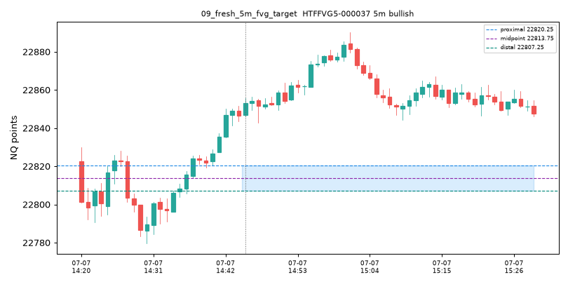

## 10_fresh_15m_fvg_target
- object_id: HTFFVG15-000067
- timeframe: 15
- direction: bearish
- abc: ['HTF15m-000376', 'HTF15m-000377', 'HTF15m-000378']
- zone: [23006.25, 23032.5]
- proximal: 23006.25
- midpoint: 23019.375
- distal: 23032.5
- width_atr: 1.2603
- available_seq: 5668
- first_fill_seq: 6513
- full_fill_seq: None
- failed_seq: None
- final_state: filled

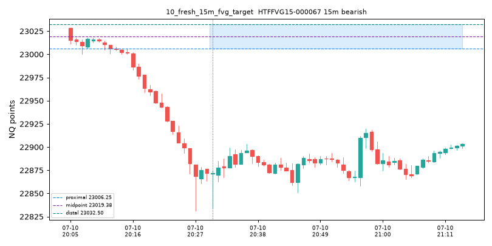

## 11_fresh_30m_fvg_target
- object_id: HTFFVG30-000032
- timeframe: 30
- direction: bearish
- abc: ['HTF30m-000188', 'HTF30m-000189', 'HTF30m-000190']
- zone: [22919.75, 23029.5]
- proximal: 22919.75
- midpoint: 22974.625
- distal: 23029.5
- width_atr: 2.538
- available_seq: 5698
- first_fill_seq: 5719
- full_fill_seq: None
- failed_seq: None
- final_state: filled

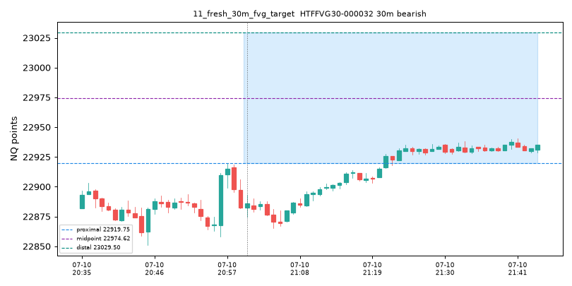

## 12_fresh_60m_fvg_target
- object_id: HTFFVG60-000011
- timeframe: 60
- direction: bearish
- abc: ['HTF60m-000094', 'HTF60m-000095', 'HTF60m-000096']
- zone: [22940.75, 23029.5]
- proximal: 22940.75
- midpoint: 22985.125
- distal: 23029.5
- width_atr: 1.5243
- available_seq: 5758
- first_fill_seq: 5792
- full_fill_seq: None
- failed_seq: None
- final_state: filled

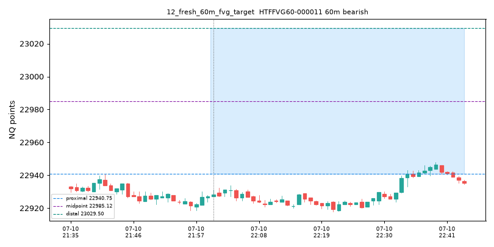

## 13_failed_fvg_excluded
- object_id: HTFFVG5-000001
- timeframe: 5
- direction: bearish
- abc: ['HTF5m-000011', 'HTF5m-000012', 'HTF5m-000013']
- zone: [22977.75, 22981.5]
- proximal: 22977.75
- midpoint: 22979.625
- distal: 22981.5
- width_atr: None
- available_seq: 65
- first_fill_seq: 70
- full_fill_seq: 70
- failed_seq: 70
- final_state: failed

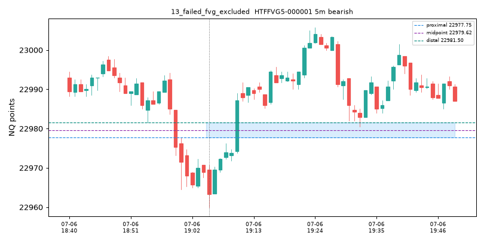

## 14_fvg_proximal_edge_target
- candidate_id: GNC-007636
- branch_id: GBR-004606
- graph: BEARISH_FVG_FORMED -> BEARISH_FVG_FIRST_TOUCH -> FIRST_TOUCH_SHORT_TRIGGER
- trigger_timestamp_et: 2025-07-07 14:45:00-04:00
- direction: short
- trigger_family: fvg_fill
- stop_anchor: {'type': 'fvg_boundary', 'rule': 'fvg_fill|stop=fvg_boundary|target=opposing_liquidity|policy=NEAREST_OPPOSING_HTF_FVG', 'price': 22857.75}
- selected_target: {'object_id': 'HTFFVG5-000037', 'family': 'htf_fvg', 'timeframe': 5, 'surface': 'PROXIMAL_EDGE', 'policy': 'NEAREST_OPPOSING_HTF_FVG', 'rank': 0, 'selection_rule': 'NEAREST_OPPOSING_HTF_FVG|htf_fvg|rank=0', 'price': 22820.25}
- natural_stop: 22857.75
- natural_target: 22820.25
- natural_rr: 7.3333
- executed_target: 22848.75
- executed_rr: 1.0
- n_considered_targets: 56
- considered_targets: 56 rows (see considered_targets.csv.gz)
- outcome_shown_separately: UNEVALUATED

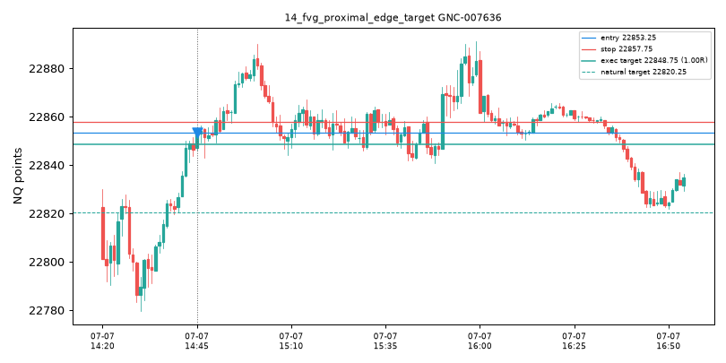

## 15_fvg_midpoint_research_variant
- note: MIDPOINT/DISTAL_EDGE are frozen research surfaces exposed on every HTFFVG.surface(); executable candidates default to PROXIMAL_EDGE and no candidate switches surface from outcome.

## 16_rb_continuation_targets_prominent_wick
- candidate_id: GNC-018734
- branch_id: GBR-009932
- graph: BEARISH_RB_CONFIRMED -> BEARISH_RB_TAP -> GOOD_BEARISH_DISPLACEMENT -> FORMATION_CLOSE_SHORT_TRIGGER
- trigger_timestamp_et: 2025-07-08 14:58:00-04:00
- direction: short
- trigger_family: rb_reaction
- stop_anchor: {'type': 'rb_invalidation_boundary', 'rule': 'rb_reaction|stop=rb_invalidation_boundary|target=opposing_liquidity|policy=NEAREST_PROMINENT_WICK', 'price': 22911.5}
- selected_target: {'object_id': 'WICK15-000283', 'family': 'wick_liquidity', 'timeframe': 15, 'surface': 'PROXIMAL_EDGE', 'policy': 'NEAREST_PROMINENT_WICK', 'rank': 0, 'selection_rule': 'NEAREST_PROMINENT_WICK|wick_liquidity|rank=0', 'price': 22894.25}
- natural_stop: 22911.5
- natural_target: 22894.25
- natural_rr: 0.5
- executed_target: 22894.25
- executed_rr: 0.5
- n_considered_targets: 208
- considered_targets: 208 rows (see considered_targets.csv.gz)
- outcome_shown_separately: UNEVALUATED

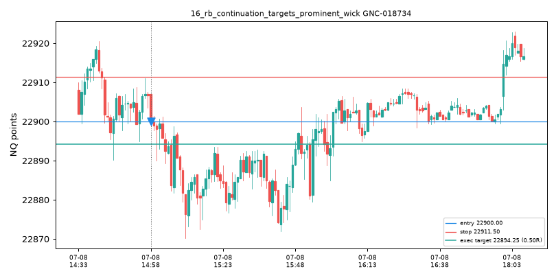

## 17_fvg_continuation_targets_htf_fvg
- candidate_id: GNC-007636
- branch_id: GBR-004606
- graph: BEARISH_FVG_FORMED -> BEARISH_FVG_FIRST_TOUCH -> FIRST_TOUCH_SHORT_TRIGGER
- trigger_timestamp_et: 2025-07-07 14:45:00-04:00
- direction: short
- trigger_family: fvg_fill
- stop_anchor: {'type': 'fvg_boundary', 'rule': 'fvg_fill|stop=fvg_boundary|target=opposing_liquidity|policy=NEAREST_OPPOSING_HTF_FVG', 'price': 22857.75}
- selected_target: {'object_id': 'HTFFVG5-000037', 'family': 'htf_fvg', 'timeframe': 5, 'surface': 'PROXIMAL_EDGE', 'policy': 'NEAREST_OPPOSING_HTF_FVG', 'rank': 0, 'selection_rule': 'NEAREST_OPPOSING_HTF_FVG|htf_fvg|rank=0', 'price': 22820.25}
- natural_stop: 22857.75
- natural_target: 22820.25
- natural_rr: 7.3333
- executed_target: 22848.75
- executed_rr: 1.0
- n_considered_targets: 56
- considered_targets: 56 rows (see considered_targets.csv.gz)
- outcome_shown_separately: UNEVALUATED

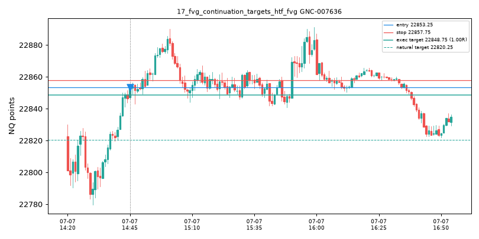

## 18_sweep_fade_targets_opposing_mtf_liquidity
- candidate_id: GNC-007649
- branch_id: GBR-004712
- graph: SWING_HIGH_SWEEP_ABOVE -> FORMATION_CLOSE_SHORT_TRIGGER
- trigger_timestamp_et: 2025-07-07 14:49:00-04:00
- direction: short
- trigger_family: sweep_fade
- stop_anchor: {'type': 'swept_extreme', 'rule': 'sweep_fade|stop=swept_extreme|target=opposing_liquidity|policy=NEAREST_OPPOSING_HTF_FVG', 'price': 22857.0}
- selected_target: {'object_id': 'HTFFVG5-000037', 'family': 'htf_fvg', 'timeframe': 5, 'surface': 'PROXIMAL_EDGE', 'policy': 'NEAREST_OPPOSING_HTF_FVG', 'rank': 0, 'selection_rule': 'NEAREST_OPPOSING_HTF_FVG|htf_fvg|rank=0', 'price': 22820.25}
- natural_stop: 22857.0
- natural_target: 22820.25
- natural_rr: 7.1667
- executed_target: 22848.0
- executed_rr: 1.0
- n_considered_targets: 58
- considered_targets: 58 rows (see considered_targets.csv.gz)
- outcome_shown_separately: UNEVALUATED

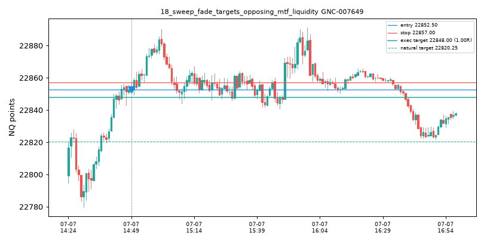

## 19_vwap_path_retains_semantic_vwap_target
- candidate_id: GNC-000007
- branch_id: GBR-000015
- graph: BEARISH_FVG_FORMED -> BEARISH_FVG_FIRST_FILL -> FIRST_FILL_SHORT_TRIGGER
- trigger_timestamp_et: 2025-07-06 18:13:00-04:00
- direction: short
- trigger_family: fvg_fill
- stop_anchor: {'type': 'fvg_boundary', 'rule': 'fvg_fill|stop=fvg_boundary|target=opposing_liquidity|policy=NEAREST_VALID_STRUCTURE', 'price': 22998.5}
- selected_target: {'object_id': 'VWAP-000001:vwap', 'family': 'vwap', 'timeframe': 'session', 'surface': 'PROXIMAL_EDGE', 'policy': 'NEAREST_VALID_STRUCTURE', 'rank': 0, 'selection_rule': 'NEAREST_VALID_STRUCTURE|vwap|rank=0', 'price': 22995.6890202124}
- natural_stop: 22998.5
- natural_target: 22995.6890202124
- natural_rr: 0.874
- executed_target: 22995.6890202124
- executed_rr: 0.874
- n_considered_targets: 6
- considered_targets: 6 rows (see considered_targets.csv.gz)
- outcome_shown_separately: UNEVALUATED

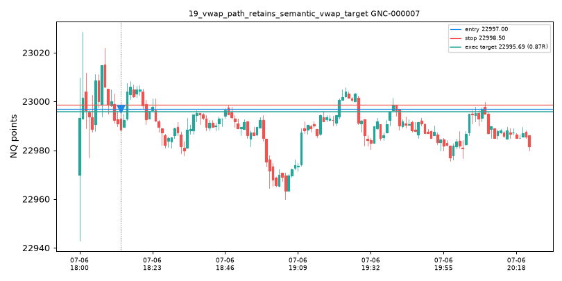

## 20_natural_0p5_to_1R_accepted
- candidate_id: GNC-000007
- branch_id: GBR-000015
- graph: BEARISH_FVG_FORMED -> BEARISH_FVG_FIRST_FILL -> FIRST_FILL_SHORT_TRIGGER
- trigger_timestamp_et: 2025-07-06 18:13:00-04:00
- direction: short
- trigger_family: fvg_fill
- stop_anchor: {'type': 'fvg_boundary', 'rule': 'fvg_fill|stop=fvg_boundary|target=opposing_liquidity|policy=NEAREST_VALID_STRUCTURE', 'price': 22998.5}
- selected_target: {'object_id': 'VWAP-000001:vwap', 'family': 'vwap', 'timeframe': 'session', 'surface': 'PROXIMAL_EDGE', 'policy': 'NEAREST_VALID_STRUCTURE', 'rank': 0, 'selection_rule': 'NEAREST_VALID_STRUCTURE|vwap|rank=0', 'price': 22995.6890202124}
- natural_stop: 22998.5
- natural_target: 22995.6890202124
- natural_rr: 0.874
- executed_target: 22995.6890202124
- executed_rr: 0.874
- n_considered_targets: 6
- considered_targets: 6 rows (see considered_targets.csv.gz)
- outcome_shown_separately: UNEVALUATED

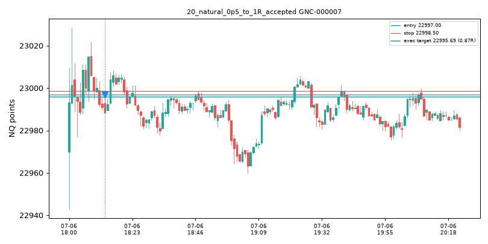

## 21_natural_gt_1R_capped_to_1R
- candidate_id: GNC-000004
- branch_id: GBR-000014
- graph: BEARISH_FVG_FORMED -> BEARISH_FVG_FIRST_TOUCH -> FIRST_TOUCH_SHORT_TRIGGER
- trigger_timestamp_et: 2025-07-06 18:13:00-04:00
- direction: short
- trigger_family: fvg_fill
- stop_anchor: {'type': 'fvg_boundary', 'rule': 'fvg_fill|stop=fvg_boundary|target=opposing_liquidity|policy=BRANCH_SEMANTIC', 'price': 22998.5}
- selected_target: {'object_id': 'LVL-000090', 'family': 'branch:opposing_liquidity', 'timeframe': None, 'surface': 'PROXIMAL_EDGE', 'policy': 'BRANCH_SEMANTIC', 'rank': 0, 'selection_rule': 'BRANCH_SEMANTIC|branch:opposing_liquidity|rank=0', 'price': 22977.0}
- natural_stop: 22998.5
- natural_target: 22977.0
- natural_rr: 7.6
- executed_target: 22993.5
- executed_rr: 1.0
- n_considered_targets: 6
- considered_targets: 6 rows (see considered_targets.csv.gz)
- outcome_shown_separately: UNEVALUATED

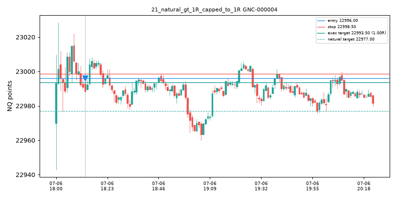

## 22_below_0p5R_rejected_no_manipulation
- candidate_id: GNC-000001
- branch_id: GBR-000004
- graph: SWING_LOW_BREAK -> SWING_LOW_ACCEPTANCE_ABOVE -> FORMATION_CLOSE_LONG_TRIGGER
- trigger_timestamp_et: 2025-07-06 18:07:00-04:00
- direction: long
- trigger_family: break_accept_cont
- stop_anchor: {'type': 'accepted_boundary', 'rule': 'break_accept_cont|stop=accepted_boundary|target=NONE|policy=NEAREST_VALID_STRUCTURE', 'price': 22976.5}
- selected_target: {'object_id': 'VWAP-000001:+2.618', 'family': 'vwap_band', 'timeframe': 'session', 'surface': 'PROXIMAL_EDGE', 'policy': 'NEAREST_VALID_STRUCTURE', 'rank': 0, 'selection_rule': 'NEAREST_VALID_STRUCTURE|vwap_band|rank=0', 'price': 23021.97922747846}
- natural_stop: 22976.5
- natural_target: 23021.97922747846
- natural_rr: 0.189
- executed_target: 0.0
- executed_rr: 0.0
- n_considered_targets: 2
- considered_targets: 2 rows (see considered_targets.csv.gz)
- outcome_shown_separately: UNEVALUATED

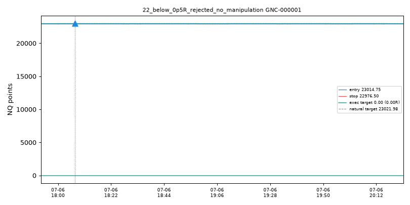

## 23_same_graph_two_target_policies
- note: same trigger/graph resolved under two distinct target policies (separate research candidates, never merged)
- variants: [{'candidate_id': 'GNC-000006', 'target_policy_id': 'BRANCH_SEMANTIC', 'target_family': 'branch:opposing_liquidity', 'target_price': 22977.0, 'executed_rr': 1.0}, {'candidate_id': 'GNC-000007', 'target_policy_id': 'NEAREST_VALID_STRUCTURE', 'target_family': 'vwap', 'target_price': 22995.6890202124, 'executed_rr': 0.874}]

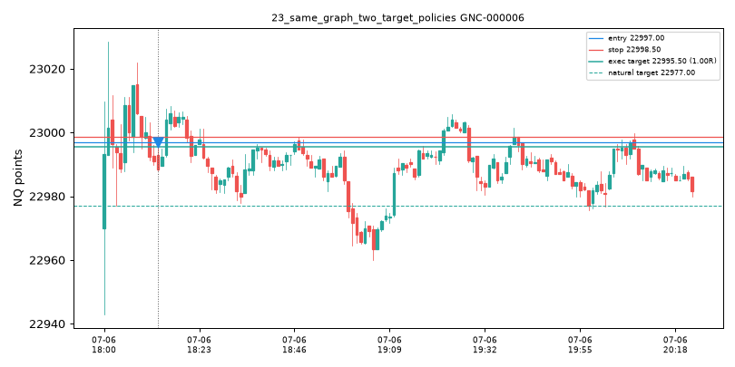

## 24_occluded_farther_target_rejected
- candidate_id: GNC-000004
- note: a farther active target is occluded by a nearer one and is not selected; both retained in the ledger
- occluded_target: {'object_id': 'LVL-000090', 'family': 'swing', 'subtype': 'swing_low', 'timeframe': '1m', 'surface': 'PROXIMAL_EDGE', 'price': 22977.0, 'available_seq': 5, 'fresh': True, 'prominence': None, 'distance_atr': None, 'natural_rr': 7.6, 'eligible': True, 'frontmost': False, 'occluded_by': 'VWAP-000001:vwap', 'rejection_reasons': []}

## 25_no_future_information_in_selection
- note: Target selection reads only structures with available_seq <= entry_seq (bisect in TargetInventory._raw); freshness/fill/sweep states are stamped from completed 1-minute bars after availability; outcome is evaluated only after the candidate is stored.
