# Development Audit Pack — Causal Episode Recognizer v1

July 2025 development data (contaminated). Examples selected chronologically, never by profit. Outcome shown separately from the frozen candidate; qualification uses prior sessions only.

## 01_rb_tap_good_disp_continuation
- kind: candidate
- candidate_id: SETUP-003428
- episode_id: EP-000474
- branch_id: BR-000238
- primitive_event_ids: ['EVT-0003374', 'EVT-0003379']
- exact_graph: GOOD_BEARISH_DISPLACEMENT -> BULLISH_RB_FAILURE -> MIDPOINT_SHORT_TRIGGER
- reduced_graph: STRONG_DISPLACEMENT -> STRUCTURAL_ZONE_INTERACTION -> ENTRY_TRIGGER
- edge_reasons: [['EVT-0003374', 'origin'], ['EVT-0003379', 'price_response:inversion'], ['EVT-0003573', 'price_response:directional'], ['EVT-0003574', 'price_response:directional'], ['EVT-0003576', 'price_response:inversion'], ['EVT-0003577', 'price_response:directional'], ['EVT-0003579', 'price_response:directional'], ['EVT-0003601', 'same_object'], ['EVT-0003602', 'same_object'], ['EVT-0003603', 'price_response:directional'], ['EVT-0003617', 'price_response:directional'], ['EVT-0003618', 'price_response:directional']]
- timestamp_et: 2025-07-06 21:17:00-04:00
- direction: short
- trigger: midpoint
- entry: 22938.375
- stop: 22943.75
- natural_target: 22914.5
- natural_rr: 4.4419
- executed_target: 22933.0
- executed_rr: 1.0
- expiry_rule: 120_bars_or_segment_end
- evidence_summary: {'effective_sample': 0, 'unique_sessions': 0, 'shrunk_expected_R': 0.0, 'reduced_estimate': 0.0, 'exact_estimate': 0.0, 'uncertainty': 1.0, 'recency_ok': False}
- qualification: RECORDED_NOT_ACTIVATED
- outcome_shown_separately: LOSS

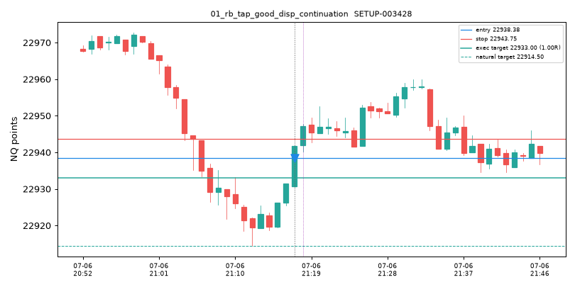

## 02_rb_bad_disp_compression_unresolved
- kind: branch
- branch_id: BR-004268
- episode_id: EP-000021
- state: UNRESOLVED
- exact_graph: BEARISH_FVG_FORMED -> BEARISH_FVG_MIDPOINT -> COMPRESSION -> BEARISH_FVG_FULL_FILL -> BEARISH_FVG_FAILURE -> VWAP_VWAP_UP -> SWING_HIGH_SWEEP_ABOVE -> SWING_LOW_BREAK
- primitive_event_ids: ['EVT-0000031', 'EVT-0000037', 'EVT-0000041', 'EVT-0000047', 'EVT-0000096', 'EVT-0000099', 'EVT-0000388', 'EVT-0001349']
- depth: 8
- terminated_reason: depth

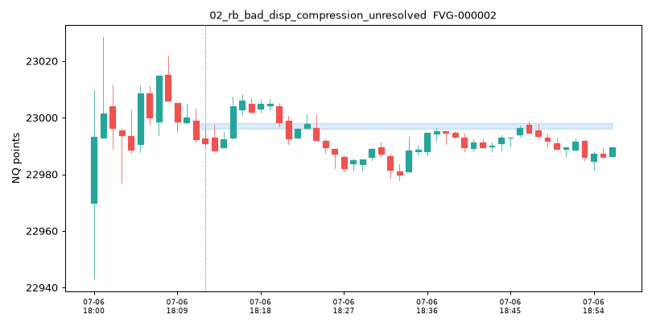

## 03_rb_bad_disp_failure_fade
- kind: candidate
- candidate_id: SETUP-008383
- episode_id: EP-002062
- branch_id: BR-000670
- primitive_event_ids: ['EVT-0015298']
- exact_graph: SWING_LOW_SWEEP_ABOVE -> FORMATION_CLOSE_SHORT_TRIGGER
- reduced_graph: LIQUIDITY_SWEEP -> ENTRY_TRIGGER
- edge_reasons: [['EVT-0015298', 'origin'], ['EVT-0015331', 'price_response:directional'], ['EVT-0015332', 'same_object'], ['EVT-0015408', 'price_response:directional'], ['EVT-0015753', 'price_response:directional'], ['EVT-0015754', 'same_object'], ['EVT-0015755', 'price_response:directional'], ['EVT-0015794', 'price_response:directional'], ['EVT-0015798', 'same_object'], ['EVT-0015882', 'price_response:directional'], ['EVT-0015887', 'same_object'], ['EVT-0015889', 'price_response:inversion']]
- timestamp_et: 2025-07-07 04:12:00-04:00
- direction: short
- trigger: formation_close
- entry: 22917.5
- stop: 22922.5
- natural_target: 22914.5
- natural_rr: 0.6
- executed_target: 22914.5
- executed_rr: 0.6
- expiry_rule: 120_bars_or_segment_end
- evidence_summary: {'effective_sample': 1, 'unique_sessions': 1, 'shrunk_expected_R': -0.0021, 'reduced_estimate': -0.0253, 'exact_estimate': -0.0021, 'uncertainty': 0.8609, 'recency_ok': True}
- qualification: RECORDED_NOT_ACTIVATED
- outcome_shown_separately: LOSS

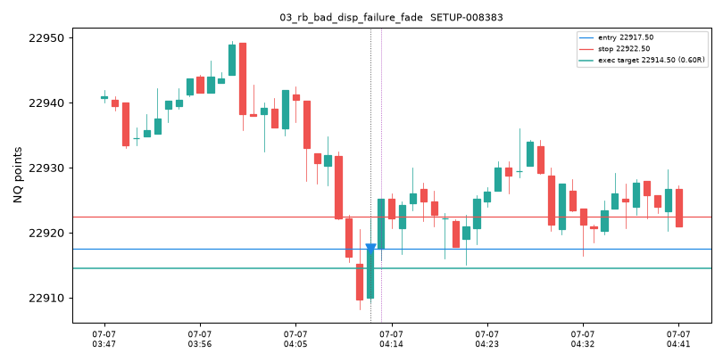

## 04_fvg_formation_immediate_continuation
- kind: candidate
- candidate_id: SETUP-000003
- episode_id: EP-000148
- branch_id: BR-000081
- primitive_event_ids: ['EVT-0000821']
- exact_graph: BULLISH_FVG_FORMED -> FORMATION_CLOSE_LONG_TRIGGER
- reduced_graph: GAP_FORMATION -> ENTRY_TRIGGER
- edge_reasons: [['EVT-0000821', 'origin']]
- timestamp_et: 2025-07-06 19:17:00-04:00
- direction: long
- trigger: formation_close
- entry: 22991.75
- stop: 22988.25
- natural_target: 22994.25
- natural_rr: 0.7143
- executed_target: 22994.25
- executed_rr: 0.7143
- expiry_rule: 120_bars_or_segment_end
- evidence_summary: {'effective_sample': 0, 'unique_sessions': 0, 'shrunk_expected_R': 0.0, 'reduced_estimate': 0.0, 'exact_estimate': 0.0, 'uncertainty': 1.0, 'recency_ok': False}
- qualification: RECORDED_NOT_ACTIVATED
- outcome_shown_separately: WIN

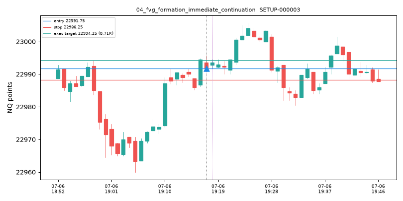

## 05_fvg_formation_continuation_without_fill
- kind: candidate
- candidate_id: SETUP-000003
- episode_id: EP-000148
- branch_id: BR-000081
- primitive_event_ids: ['EVT-0000821']
- exact_graph: BULLISH_FVG_FORMED -> FORMATION_CLOSE_LONG_TRIGGER
- reduced_graph: GAP_FORMATION -> ENTRY_TRIGGER
- edge_reasons: [['EVT-0000821', 'origin']]
- timestamp_et: 2025-07-06 19:17:00-04:00
- direction: long
- trigger: formation_close
- entry: 22991.75
- stop: 22988.25
- natural_target: 22994.25
- natural_rr: 0.7143
- executed_target: 22994.25
- executed_rr: 0.7143
- expiry_rule: 120_bars_or_segment_end
- evidence_summary: {'effective_sample': 0, 'unique_sessions': 0, 'shrunk_expected_R': 0.0, 'reduced_estimate': 0.0, 'exact_estimate': 0.0, 'uncertainty': 1.0, 'recency_ok': False}
- qualification: RECORDED_NOT_ACTIVATED
- outcome_shown_separately: WIN

## 06_fvg_first_touch_continuation
- kind: candidate
- candidate_id: SETUP-000757
- episode_id: EP-000106
- branch_id: BR-000059
- primitive_event_ids: ['EVT-0000580', 'EVT-0000656', 'EVT-0000662', 'EVT-0000689']
- exact_graph: BEARISH_FVG_FORMED -> BEARISH_FVG_FIRST_TOUCH -> BEARISH_FVG_FULL_FILL -> BEARISH_IFVG_FIRST_TOUCH -> FIRST_TOUCH_SHORT_TRIGGER
- reduced_graph: GAP_FORMATION -> GAP_FILL -> INVERSION_INTERACTION -> ENTRY_TRIGGER
- edge_reasons: [['EVT-0000580', 'origin'], ['EVT-0000656', 'same_object'], ['EVT-0000662', 'price_response:directional'], ['EVT-0000689', 'price_response:directional'], ['EVT-0001140', 'price_response:directional'], ['EVT-0001141', 'price_response:directional'], ['EVT-0001144', 'price_response:directional'], ['EVT-0001147', 'price_response:directional'], ['EVT-0001148', 'price_response:directional'], ['EVT-0001149', 'price_response:directional'], ['EVT-0001150', 'price_response:directional'], ['EVT-0001151', 'price_response:directional']]
- timestamp_et: 2025-07-06 19:10:00-04:00
- direction: short
- trigger: first_touch
- entry: 22984.75
- stop: 22989.75
- natural_target: 22981.5
- natural_rr: 0.65
- executed_target: 22981.5
- executed_rr: 0.65
- expiry_rule: 120_bars_or_segment_end
- evidence_summary: {'effective_sample': 0, 'unique_sessions': 0, 'shrunk_expected_R': 0.0, 'reduced_estimate': 0.0, 'exact_estimate': 0.0, 'uncertainty': 1.0, 'recency_ok': False}
- qualification: RECORDED_NOT_ACTIVATED
- outcome_shown_separately: LOSS

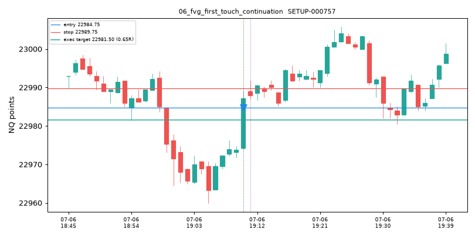

## 07_fvg_failure_ifvg_immediate
- kind: candidate
- candidate_id: SETUP-001533
- episode_id: EP-000257
- branch_id: BR-000138
- primitive_event_ids: ['EVT-0001644']
- exact_graph: BEARISH_IFVG_ACTIVATION -> FORMATION_CLOSE_SHORT_TRIGGER
- reduced_graph: INVERSION_ACTIVATION -> ENTRY_TRIGGER
- edge_reasons: [['EVT-0001644', 'origin'], ['EVT-0001963', 'same_object'], ['EVT-0002226', 'price_response:inversion'], ['EVT-0002228', 'price_response:inversion'], ['EVT-0002230', 'price_response:inversion'], ['EVT-0002232', 'price_response:inversion'], ['EVT-0002234', 'price_response:inversion'], ['EVT-0002236', 'price_response:inversion'], ['EVT-0002238', 'price_response:inversion'], ['EVT-0002239', 'price_response:directional'], ['EVT-0002241', 'price_response:directional'], ['EVT-0002243', 'price_response:directional']]
- timestamp_et: 2025-07-06 19:49:00-04:00
- direction: short
- trigger: formation_close
- entry: 22987.0
- stop: 22990.5
- natural_target: 22985.25
- natural_rr: 0.5
- executed_target: 22985.25
- executed_rr: 0.5
- expiry_rule: 120_bars_or_segment_end
- evidence_summary: {'effective_sample': 0, 'unique_sessions': 0, 'shrunk_expected_R': 0.0, 'reduced_estimate': 0.0, 'exact_estimate': 0.0, 'uncertainty': 1.0, 'recency_ok': False}
- qualification: RECORDED_NOT_ACTIVATED
- outcome_shown_separately: WIN

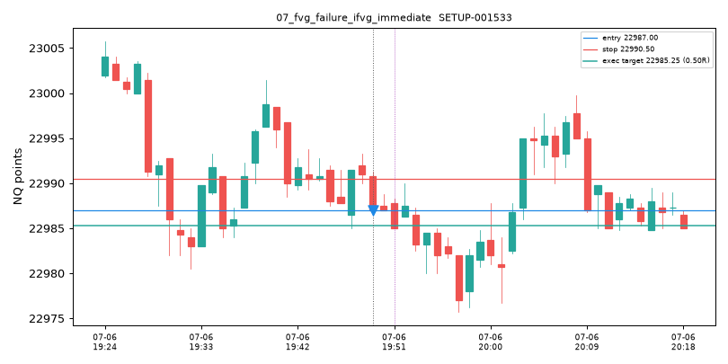

## 08_sweep_ifvg_activation
- kind: candidate
- candidate_id: SETUP-002228
- episode_id: EP-002462
- branch_id: BR-000798
- primitive_event_ids: ['EVT-0018412']
- exact_graph: SWING_LOW_SWEEP_ABOVE -> RETEST_SHORT_TRIGGER
- reduced_graph: LIQUIDITY_SWEEP -> ENTRY_TRIGGER
- edge_reasons: [['EVT-0018412', 'origin'], ['EVT-0018450', 'price_response:inversion'], ['EVT-0018486', 'price_response:directional'], ['EVT-0018487', 'price_response:directional'], ['EVT-0018519', 'price_response:inversion'], ['EVT-0018520', 'price_response:directional'], ['EVT-0018522', 'price_response:inversion'], ['EVT-0018523', 'price_response:directional'], ['EVT-0018524', 'price_response:directional'], ['EVT-0018525', 'price_response:directional'], ['EVT-0018526', 'price_response:directional'], ['EVT-0018529', 'price_response:inversion']]
- timestamp_et: 2025-07-07 06:10:00-04:00
- direction: short
- trigger: retest
- entry: 22979.25
- stop: 22982.0
- natural_target: 22977.75
- natural_rr: 0.5455
- executed_target: 22977.75
- executed_rr: 0.5455
- expiry_rule: 120_bars_or_segment_end
- evidence_summary: {'effective_sample': 0, 'unique_sessions': 0, 'shrunk_expected_R': -0.0806, 'reduced_estimate': -0.0806, 'exact_estimate': -0.0806, 'uncertainty': 1.0, 'recency_ok': False}
- qualification: RECORDED_NOT_ACTIVATED
- outcome_shown_separately: WIN

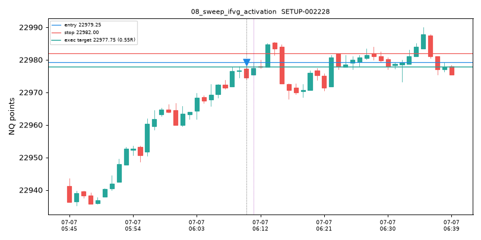

## 09_sweep_reclaim_fade
- kind: candidate
- candidate_id: SETUP-005139
- episode_id: EP-000041
- branch_id: BR-000014
- primitive_event_ids: ['EVT-0000112']
- exact_graph: SWING_LOW_SWEEP_BELOW -> FORMATION_CLOSE_LONG_TRIGGER
- reduced_graph: LIQUIDITY_SWEEP -> ENTRY_TRIGGER
- edge_reasons: [['EVT-0000112', 'origin'], ['EVT-0000125', 'price_response:directional'], ['EVT-0000139', 'price_response:directional'], ['EVT-0000140', 'same_object'], ['EVT-0000141', 'same_object'], ['EVT-0000142', 'same_object'], ['EVT-0000152', 'same_object'], ['EVT-0000155', 'price_response:directional'], ['EVT-0000156', 'price_response:directional'], ['EVT-0000177', 'price_response:directional'], ['EVT-0000534', 'price_response:directional'], ['EVT-0000598', 'same_object']]
- timestamp_et: 2025-07-06 18:25:00-04:00
- direction: long
- trigger: formation_close
- entry: 22989.5
- stop: 22987.0
- natural_target: 22990.75
- natural_rr: 0.5
- executed_target: 22990.75
- executed_rr: 0.5
- expiry_rule: 120_bars_or_segment_end
- evidence_summary: {'effective_sample': 0, 'unique_sessions': 0, 'shrunk_expected_R': 0.0, 'reduced_estimate': 0.0, 'exact_estimate': 0.0, 'uncertainty': 1.0, 'recency_ok': False}
- qualification: RECORDED_NOT_ACTIVATED
- outcome_shown_separately: LOSS

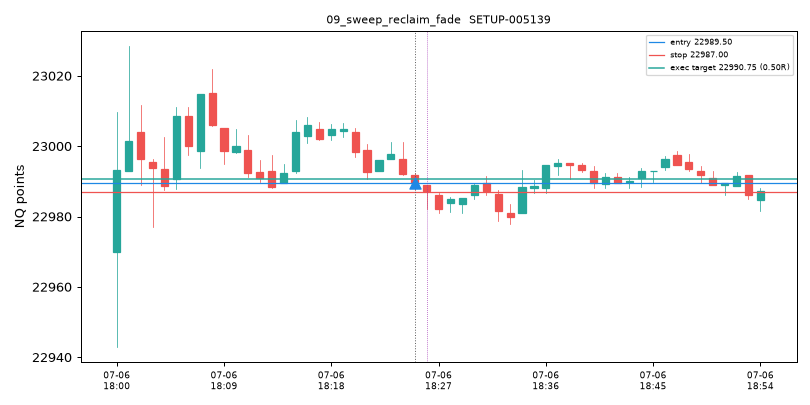

## 10_sweep_acceptance_continuation
- kind: candidate
- candidate_id: SETUP-041471
- episode_id: EP-000022
- branch_id: BR-000006
- primitive_event_ids: ['EVT-0000033']
- exact_graph: VWAP_VWAP_BOUNCE_DOWN -> FORMATION_CLOSE_SHORT_TRIGGER
- reduced_graph: VWAP_INTERACTION -> ENTRY_TRIGGER
- edge_reasons: [['EVT-0000033', 'origin'], ['EVT-0000039', 'same_object'], ['EVT-0000089', 'price_response:directional'], ['EVT-0000188', 'price_response:directional'], ['EVT-0000227', 'same_object'], ['EVT-0000274', 'same_object'], ['EVT-0000389', 'price_response:directional'], ['EVT-0000390', 'price_response:directional'], ['EVT-0000391', 'same_object'], ['EVT-0000795', 'price_response:directional'], ['EVT-0001983', 'price_response:inversion'], ['EVT-0001985', 'price_response:inversion']]
- timestamp_et: 2025-07-06 18:12:00-04:00
- direction: short
- trigger: formation_close
- entry: 22991.0
- stop: 22996.270686043466
- natural_target: 22977.0
- natural_rr: 2.6562
- executed_target: 22985.729313956534
- executed_rr: 1.0
- expiry_rule: 120_bars_or_segment_end
- evidence_summary: {'effective_sample': 0, 'unique_sessions': 0, 'shrunk_expected_R': 0.0, 'reduced_estimate': 0.0, 'exact_estimate': 0.0, 'uncertainty': 1.0, 'recency_ok': False}
- qualification: RECORDED_NOT_ACTIVATED
- outcome_shown_separately: LOSS

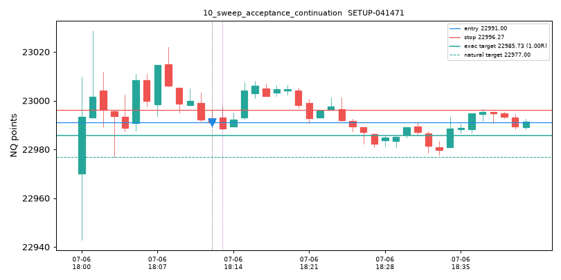

## 11_time_anchor_reclaim_no_fvg
- kind: candidate
- candidate_id: SETUP-003934
- episode_id: EP-000373
- branch_id: BR-000190
- primitive_event_ids: ['EVT-0002556']
- exact_graph: ANCHOR_ASIA_OPEN_RECLAIM -> RETEST_SHORT_TRIGGER
- reduced_graph: RECLAIM -> ENTRY_TRIGGER
- edge_reasons: [['EVT-0002556', 'origin'], ['EVT-0002728', 'price_response:directional'], ['EVT-0002730', 'price_response:directional'], ['EVT-0002733', 'same_object'], ['EVT-0002735', 'price_response:inversion'], ['EVT-0002737', 'price_response:inversion'], ['EVT-0002739', 'price_response:inversion'], ['EVT-0002740', 'price_response:inversion'], ['EVT-0002743', 'price_response:inversion'], ['EVT-0002744', 'price_response:inversion'], ['EVT-0002747', 'price_response:directional'], ['EVT-0002748', 'same_object']]
- timestamp_et: 2025-07-06 20:22:00-04:00
- direction: short
- trigger: retest
- entry: 22983.75
- stop: 22985.25
- natural_target: 22981.5
- natural_rr: 1.5
- executed_target: 22982.25
- executed_rr: 1.0
- expiry_rule: 120_bars_or_segment_end
- evidence_summary: {'effective_sample': 0, 'unique_sessions': 0, 'shrunk_expected_R': 0.0, 'reduced_estimate': 0.0, 'exact_estimate': 0.0, 'uncertainty': 1.0, 'recency_ok': False}
- qualification: RECORDED_NOT_ACTIVATED
- outcome_shown_separately: WIN

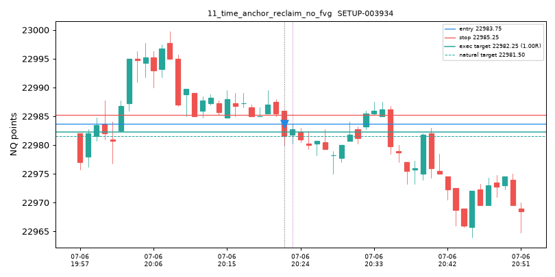

## 12_time_anchor_rejection_fade
- kind: candidate
- candidate_id: SETUP-003959
- episode_id: EP-002326
- branch_id: BR-000766
- primitive_event_ids: ['EVT-0017288']
- exact_graph: ANCHOR_LONDON_OPEN_SWEEP -> FORMATION_CLOSE_LONG_TRIGGER
- reduced_graph: LIQUIDITY_SWEEP -> ENTRY_TRIGGER
- edge_reasons: [['EVT-0017288', 'origin']]
- timestamp_et: 2025-07-07 05:47:00-04:00
- direction: long
- trigger: formation_close
- entry: 22938.25
- stop: 22937.0
- natural_target: 22939.0
- natural_rr: 0.6
- executed_target: 22939.0
- executed_rr: 0.6
- expiry_rule: 120_bars_or_segment_end
- evidence_summary: {'effective_sample': 0, 'unique_sessions': 0, 'shrunk_expected_R': -0.0806, 'reduced_estimate': -0.0806, 'exact_estimate': -0.0806, 'uncertainty': 1.0, 'recency_ok': False}
- qualification: RECORDED_NOT_ACTIVATED
- outcome_shown_separately: AMBIGUOUS

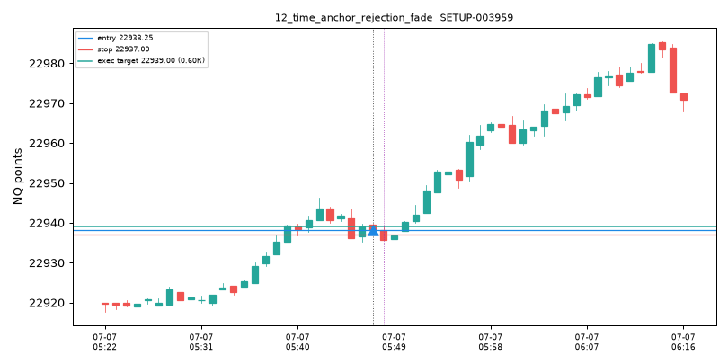

## 13_vwap_continuation
- kind: candidate
- candidate_id: SETUP-041469
- episode_id: EP-000019
- branch_id: BR-000004
- primitive_event_ids: ['EVT-0000029']
- exact_graph: VWAP_VWAP_BOUNCE_DOWN -> FIRST_TOUCH_SHORT_TRIGGER
- reduced_graph: VWAP_INTERACTION -> ENTRY_TRIGGER
- edge_reasons: [['EVT-0000029', 'origin'], ['EVT-0000033', 'same_object'], ['EVT-0000866', 'price_response:directional'], ['EVT-0000926', 'same_object'], ['EVT-0001315', 'price_response:inversion'], ['EVT-0001318', 'same_object'], ['EVT-0001321', 'price_response:inversion'], ['EVT-0002156', 'price_response:directional'], ['EVT-0002178', 'same_object'], ['EVT-0002180', 'price_response:inversion'], ['EVT-0002183', 'price_response:directional'], ['EVT-0002184', 'price_response:directional']]
- timestamp_et: 2025-07-06 18:11:00-04:00
- direction: short
- trigger: first_touch
- entry: 22992.25
- stop: 23003.75
- natural_target: 22977.0
- natural_rr: 1.3261
- executed_target: 22980.75
- executed_rr: 1.0
- expiry_rule: 120_bars_or_segment_end
- evidence_summary: {'effective_sample': 0, 'unique_sessions': 0, 'shrunk_expected_R': 0.0, 'reduced_estimate': 0.0, 'exact_estimate': 0.0, 'uncertainty': 1.0, 'recency_ok': False}
- qualification: RECORDED_NOT_ACTIVATED
- outcome_shown_separately: LOSS

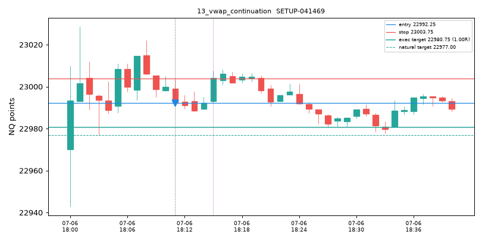

## 14_vwap_fade
- kind: candidate
- candidate_id: SETUP-041466
- episode_id: EP-000011
- branch_id: BR-000001
- primitive_event_ids: ['EVT-0000014']
- exact_graph: VWAP_VWAP_BOUNCE_UP -> FORMATION_CLOSE_SHORT_TRIGGER
- reduced_graph: VWAP_INTERACTION -> ENTRY_TRIGGER
- edge_reasons: [['EVT-0000014', 'origin'], ['EVT-0000021', 'same_object'], ['EVT-0000077', 'price_response:directional'], ['EVT-0000229', 'price_response:inversion'], ['EVT-0000232', 'price_response:directional'], ['EVT-0000235', 'price_response:directional'], ['EVT-0000236', 'same_object'], ['EVT-0000238', 'price_response:inversion'], ['EVT-0000239', 'price_response:directional'], ['EVT-0000240', 'price_response:directional'], ['EVT-0000242', 'price_response:inversion'], ['EVT-0000243', 'price_response:directional']]
- timestamp_et: 2025-07-06 18:05:00-04:00
- direction: short
- trigger: formation_close
- entry: 23008.5
- stop: 23011.5
- natural_target: 22993.340270460132
- natural_rr: 5.0532
- executed_target: 23005.5
- executed_rr: 1.0
- expiry_rule: 120_bars_or_segment_end
- evidence_summary: {'effective_sample': 0, 'unique_sessions': 0, 'shrunk_expected_R': 0.0, 'reduced_estimate': 0.0, 'exact_estimate': 0.0, 'uncertainty': 1.0, 'recency_ok': False}
- qualification: RECORDED_NOT_ACTIVATED
- outcome_shown_separately: WIN

## 15_compression_to_expansion
- kind: candidate
- candidate_id: SETUP-042592
- episode_id: EP-000024
- branch_id: BR-000010
- primitive_event_ids: ['EVT-0000041']
- exact_graph: COMPRESSION -> FORMATION_CLOSE_SHORT_TRIGGER
- reduced_graph: COMPRESSION -> ENTRY_TRIGGER
- edge_reasons: [['EVT-0000041', 'origin'], ['EVT-0000071', 'price_response:directional'], ['EVT-0000072', 'same_object'], ['EVT-0000074', 'price_response:directional'], ['EVT-0000075', 'same_object'], ['EVT-0000101', 'price_response:directional'], ['EVT-0000400', 'price_response:inversion'], ['EVT-0000973', 'price_response:directional'], ['EVT-0001001', 'same_object']]
- timestamp_et: 2025-07-06 18:17:00-04:00
- direction: short
- trigger: formation_close
- entry: 23002.0
- stop: 23007.5
- natural_target: 22988.25
- natural_rr: 2.5
- executed_target: 22996.5
- executed_rr: 1.0
- expiry_rule: 120_bars_or_segment_end
- evidence_summary: {'effective_sample': 0, 'unique_sessions': 0, 'shrunk_expected_R': 0.0, 'reduced_estimate': 0.0, 'exact_estimate': 0.0, 'uncertainty': 1.0, 'recency_ok': False}
- qualification: RECORDED_NOT_ACTIVATED
- outcome_shown_separately: WIN

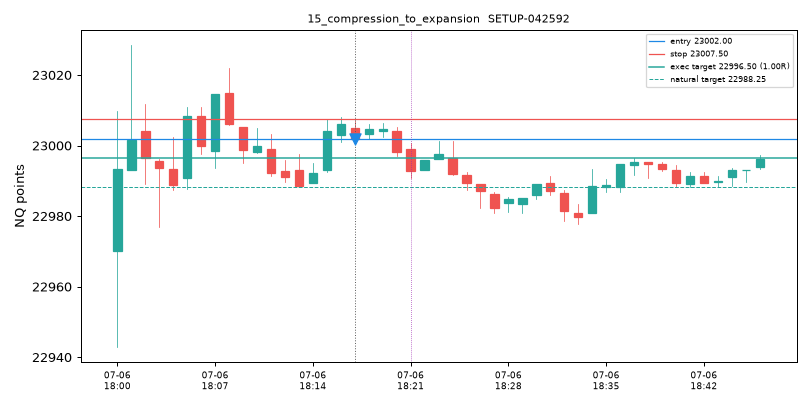

## 16_false_expansion_fade
- kind: candidate
- candidate_id: SETUP-042592
- episode_id: EP-000024
- branch_id: BR-000010
- primitive_event_ids: ['EVT-0000041']
- exact_graph: COMPRESSION -> FORMATION_CLOSE_SHORT_TRIGGER
- reduced_graph: COMPRESSION -> ENTRY_TRIGGER
- edge_reasons: [['EVT-0000041', 'origin'], ['EVT-0000071', 'price_response:directional'], ['EVT-0000072', 'same_object'], ['EVT-0000074', 'price_response:directional'], ['EVT-0000075', 'same_object'], ['EVT-0000101', 'price_response:directional'], ['EVT-0000400', 'price_response:inversion'], ['EVT-0000973', 'price_response:directional'], ['EVT-0001001', 'same_object']]
- timestamp_et: 2025-07-06 18:17:00-04:00
- direction: short
- trigger: formation_close
- entry: 23002.0
- stop: 23007.5
- natural_target: 22988.25
- natural_rr: 2.5
- executed_target: 22996.5
- executed_rr: 1.0
- expiry_rule: 120_bars_or_segment_end
- evidence_summary: {'effective_sample': 0, 'unique_sessions': 0, 'shrunk_expected_R': 0.0, 'reduced_estimate': 0.0, 'exact_estimate': 0.0, 'uncertainty': 1.0, 'recency_ok': False}
- qualification: RECORDED_NOT_ACTIVATED
- outcome_shown_separately: WIN

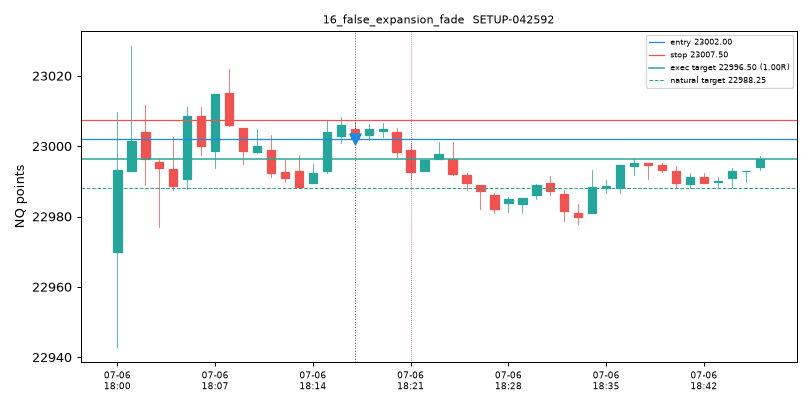

## 17_setup_without_fvg_or_ifvg
- kind: candidate
- candidate_id: SETUP-041466
- episode_id: EP-000011
- branch_id: BR-000001
- primitive_event_ids: ['EVT-0000014']
- exact_graph: VWAP_VWAP_BOUNCE_UP -> FORMATION_CLOSE_SHORT_TRIGGER
- reduced_graph: VWAP_INTERACTION -> ENTRY_TRIGGER
- edge_reasons: [['EVT-0000014', 'origin'], ['EVT-0000021', 'same_object'], ['EVT-0000077', 'price_response:directional'], ['EVT-0000229', 'price_response:inversion'], ['EVT-0000232', 'price_response:directional'], ['EVT-0000235', 'price_response:directional'], ['EVT-0000236', 'same_object'], ['EVT-0000238', 'price_response:inversion'], ['EVT-0000239', 'price_response:directional'], ['EVT-0000240', 'price_response:directional'], ['EVT-0000242', 'price_response:inversion'], ['EVT-0000243', 'price_response:directional']]
- timestamp_et: 2025-07-06 18:05:00-04:00
- direction: short
- trigger: formation_close
- entry: 23008.5
- stop: 23011.5
- natural_target: 22993.340270460132
- natural_rr: 5.0532
- executed_target: 23005.5
- executed_rr: 1.0
- expiry_rule: 120_bars_or_segment_end
- evidence_summary: {'effective_sample': 0, 'unique_sessions': 0, 'shrunk_expected_R': 0.0, 'reduced_estimate': 0.0, 'exact_estimate': 0.0, 'uncertainty': 1.0, 'recency_ok': False}
- qualification: RECORDED_NOT_ACTIVATED
- outcome_shown_separately: WIN

## 18_primitive_not_a_setup
- kind: event
- event_id: EVT-0000026
- event_subtype: BEARISH_FVG_FORMED
- object_id: FVG-000001
- timestamp_et: 2025-07-06 18:10:00-04:00
- note: primitive event only; no coherent causal path completed the six-part setup structure, so it is not a setup

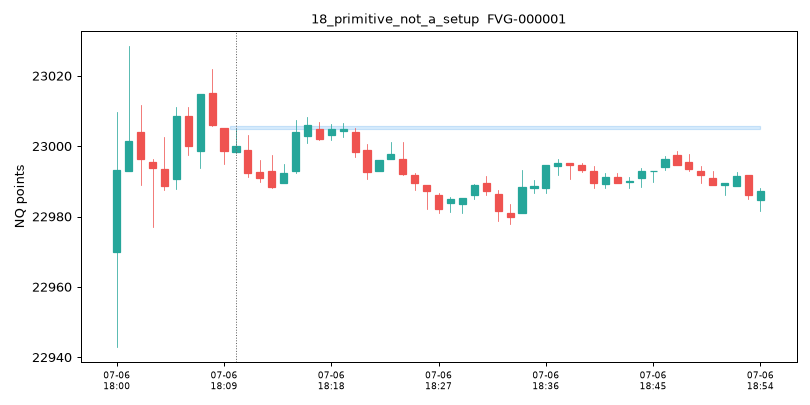

## 19_events_merged_one_episode
- kind: episode
- episode_id: EP-000004
- origin: VWAP_BAND_REJECT_M3_618
- n_objects: 7
- n_events: 16
- primitive_event_ids: ['EVT-0000004', 'EVT-0000011', 'EVT-0000012', 'EVT-0000040', 'EVT-0000050', 'EVT-0000111', 'EVT-0000112', 'EVT-0000121', 'EVT-0000122', 'EVT-0000123', 'EVT-0000127', 'EVT-0000128', 'EVT-0000129', 'EVT-0000130', 'EVT-0000136', 'EVT-0000157']
- edge_reasons: [['EVT-0000004', 'origin'], ['EVT-0000011', 'same_object'], ['EVT-0000012', 'same_object'], ['EVT-0000040', 'same_object'], ['EVT-0000050', 'price_response:directional'], ['EVT-0000111', 'same_object'], ['EVT-0000112', 'same_object'], ['EVT-0000121', 'same_object'], ['EVT-0000122', 'price_response:directional'], ['EVT-0000123', 'price_response:directional'], ['EVT-0000127', 'same_object'], ['EVT-0000128', 'same_object']]
- resolution: expired

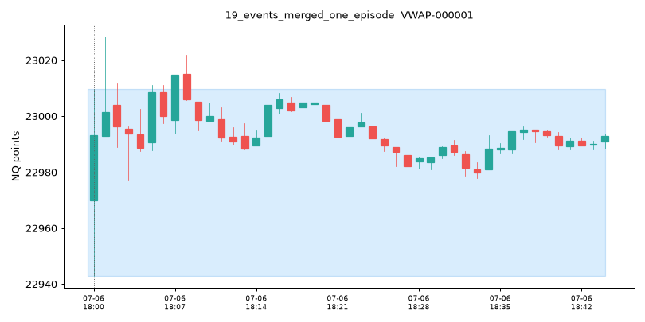

## 20_episode_multiple_branches
- kind: episode
- episode_id: EP-000566
- origin: BEARISH_FVG_FORMED
- n_objects: 7
- n_events: 10
- primitive_event_ids: ['EVT-0004025', 'EVT-0004657', 'EVT-0004660', 'EVT-0004663', 'EVT-0004666', 'EVT-0004669', 'EVT-0004670', 'EVT-0004674', 'EVT-0004675', 'EVT-0004676']
- edge_reasons: [['EVT-0004025', 'origin'], ['EVT-0004657', 'price_response:inversion'], ['EVT-0004660', 'price_response:inversion'], ['EVT-0004663', 'price_response:inversion'], ['EVT-0004666', 'price_response:directional'], ['EVT-0004669', 'price_response:directional'], ['EVT-0004670', 'price_response:directional'], ['EVT-0004674', 'same_object'], ['EVT-0004675', 'same_object'], ['EVT-0004676', 'same_object']]
- resolution: expired

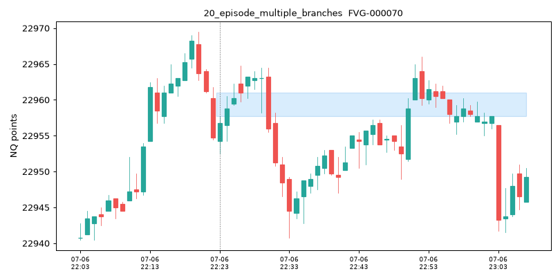

## 21_rejected_below_half_R
- kind: rejected_setup
- candidate_id: SETUP-041464
- exact_or_graph: vwap:band_reject_+1.618 -> fade_to_vwap
- direction: short
- trigger: formation_close
- entry: 23001.5
- stop: 23029.0
- natural_target: 22991.97164750958
- natural_rr: 0.3465
- rejection_reason: INSUFFICIENT_NATURAL_RR
- qualification: REJECTED_PRE_ENTRY

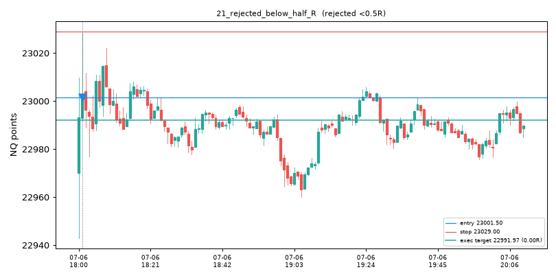

## 22_natural_half_to_1R
- kind: candidate
- candidate_id: SETUP-041467
- episode_id: EP-000014
- branch_id: BR-000002
- primitive_event_ids: ['EVT-0000019']
- exact_graph: VWAP_BAND_REJECT_P1_618 -> FORMATION_CLOSE_SHORT_TRIGGER
- reduced_graph: BAND_REJECTION -> ENTRY_TRIGGER
- edge_reasons: [['EVT-0000019', 'origin'], ['EVT-0000024', 'same_object']]
- timestamp_et: 2025-07-06 18:06:00-04:00
- direction: short
- trigger: formation_close
- entry: 23000.0
- stop: 23011.5
- natural_target: 22993.7548146904
- natural_rr: 0.5431
- executed_target: 22993.7548146904
- executed_rr: 0.5431
- expiry_rule: 120_bars_or_segment_end
- evidence_summary: {'effective_sample': 0, 'unique_sessions': 0, 'shrunk_expected_R': 0.0, 'reduced_estimate': 0.0, 'exact_estimate': 0.0, 'uncertainty': 1.0, 'recency_ok': False}
- qualification: RECORDED_NOT_ACTIVATED
- outcome_shown_separately: AMBIGUOUS

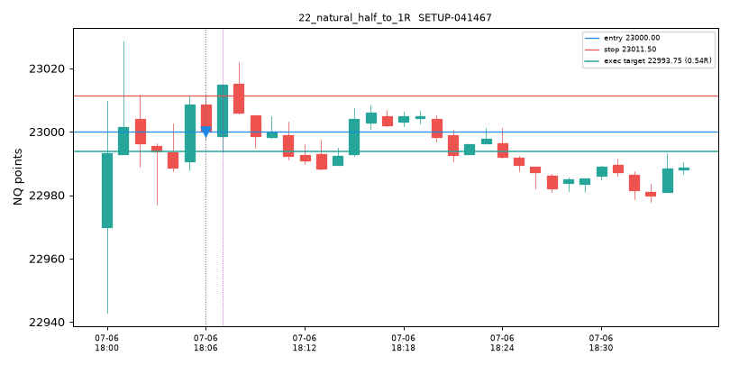

## 23_capped_1R
- kind: candidate
- candidate_id: SETUP-041466
- episode_id: EP-000011
- branch_id: BR-000001
- primitive_event_ids: ['EVT-0000014']
- exact_graph: VWAP_VWAP_BOUNCE_UP -> FORMATION_CLOSE_SHORT_TRIGGER
- reduced_graph: VWAP_INTERACTION -> ENTRY_TRIGGER
- edge_reasons: [['EVT-0000014', 'origin'], ['EVT-0000021', 'same_object'], ['EVT-0000077', 'price_response:directional'], ['EVT-0000229', 'price_response:inversion'], ['EVT-0000232', 'price_response:directional'], ['EVT-0000235', 'price_response:directional'], ['EVT-0000236', 'same_object'], ['EVT-0000238', 'price_response:inversion'], ['EVT-0000239', 'price_response:directional'], ['EVT-0000240', 'price_response:directional'], ['EVT-0000242', 'price_response:inversion'], ['EVT-0000243', 'price_response:directional']]
- timestamp_et: 2025-07-06 18:05:00-04:00
- direction: short
- trigger: formation_close
- entry: 23008.5
- stop: 23011.5
- natural_target: 22993.340270460132
- natural_rr: 5.0532
- executed_target: 23005.5
- executed_rr: 1.0
- expiry_rule: 120_bars_or_segment_end
- evidence_summary: {'effective_sample': 0, 'unique_sessions': 0, 'shrunk_expected_R': 0.0, 'reduced_estimate': 0.0, 'exact_estimate': 0.0, 'uncertainty': 1.0, 'recency_ok': False}
- qualification: RECORDED_NOT_ACTIVATED
- outcome_shown_separately: WIN

## 24_sufficient_prior_evidence
- kind: candidate
- candidate_id: SETUP-043505
- episode_id: EP-024656
- branch_id: BR-002408
- primitive_event_ids: ['EVT-0170811']
- exact_graph: SWING_HIGH_SWEEP_ABOVE -> RETEST_SHORT_TRIGGER
- reduced_graph: LIQUIDITY_SWEEP -> ENTRY_TRIGGER
- edge_reasons: [['EVT-0170811', 'origin']]
- timestamp_et: 2025-07-08 22:58:00-04:00
- direction: short
- trigger: retest
- entry: 22878.5
- stop: 22880.0
- natural_target: 22877.75
- natural_rr: 0.5
- executed_target: 22877.75
- executed_rr: 0.5
- expiry_rule: 120_bars_or_segment_end
- evidence_summary: {'effective_sample': 4, 'unique_sessions': 4, 'shrunk_expected_R': 0.1814, 'reduced_estimate': 0.0128, 'exact_estimate': 0.1814, 'uncertainty': 0.3393, 'recency_ok': True}
- qualification: QUALIFIED_PENDING_TRIGGER
- outcome_shown_separately: LOSS

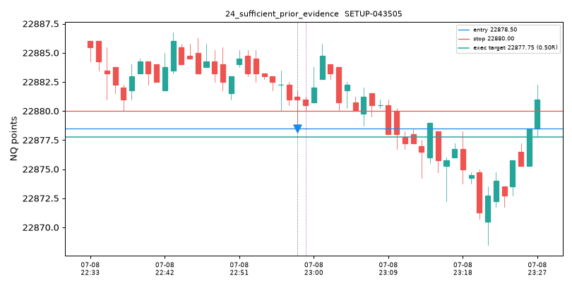

## 25_recorded_not_activated
- kind: candidate
- candidate_id: SETUP-041466
- episode_id: EP-000011
- branch_id: BR-000001
- primitive_event_ids: ['EVT-0000014']
- exact_graph: VWAP_VWAP_BOUNCE_UP -> FORMATION_CLOSE_SHORT_TRIGGER
- reduced_graph: VWAP_INTERACTION -> ENTRY_TRIGGER
- edge_reasons: [['EVT-0000014', 'origin'], ['EVT-0000021', 'same_object'], ['EVT-0000077', 'price_response:directional'], ['EVT-0000229', 'price_response:inversion'], ['EVT-0000232', 'price_response:directional'], ['EVT-0000235', 'price_response:directional'], ['EVT-0000236', 'same_object'], ['EVT-0000238', 'price_response:inversion'], ['EVT-0000239', 'price_response:directional'], ['EVT-0000240', 'price_response:directional'], ['EVT-0000242', 'price_response:inversion'], ['EVT-0000243', 'price_response:directional']]
- timestamp_et: 2025-07-06 18:05:00-04:00
- direction: short
- trigger: formation_close
- entry: 23008.5
- stop: 23011.5
- natural_target: 22993.340270460132
- natural_rr: 5.0532
- executed_target: 23005.5
- executed_rr: 1.0
- expiry_rule: 120_bars_or_segment_end
- evidence_summary: {'effective_sample': 0, 'unique_sessions': 0, 'shrunk_expected_R': 0.0, 'reduced_estimate': 0.0, 'exact_estimate': 0.0, 'uncertainty': 1.0, 'recency_ok': False}
- qualification: RECORDED_NOT_ACTIVATED
- outcome_shown_separately: WIN

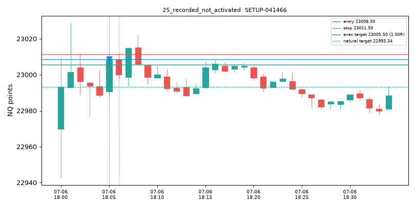
