# Development Review Pack (July 2025, contaminated dev data)

Deterministic chronological selection per category. Examples validate implementation only; they are NOT selected by profit and are NOT forward evidence. Outcome is shown separately from the frozen setup.

## 01_bullish_fvg
- primitive_id: `FVG-000020`  subtype: bullish  zone: [22974.75, 22987.00]
- timestamp (ET): 2025-07-06 19:11:00-04:00

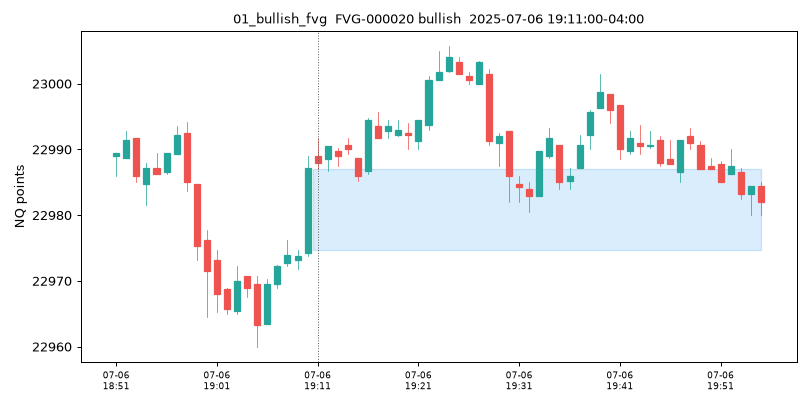

## 02_bearish_fvg
- primitive_id: `FVG-000017`  subtype: bearish  zone: [22984.75, 22989.25]
- timestamp (ET): 2025-07-06 18:59:00-04:00

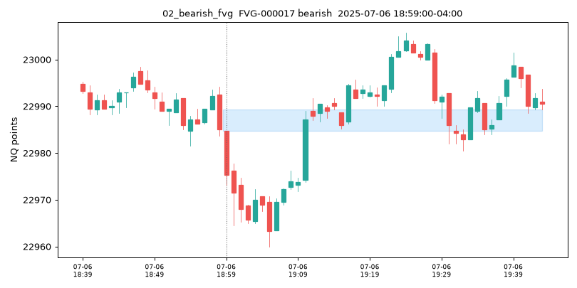

## 03_bullish_ifvg
- primitive_id: `IFVG-000014`  subtype: bullish  zone: [22977.75, 22983.75]
- timestamp (ET): 2025-07-06 19:10:00-04:00

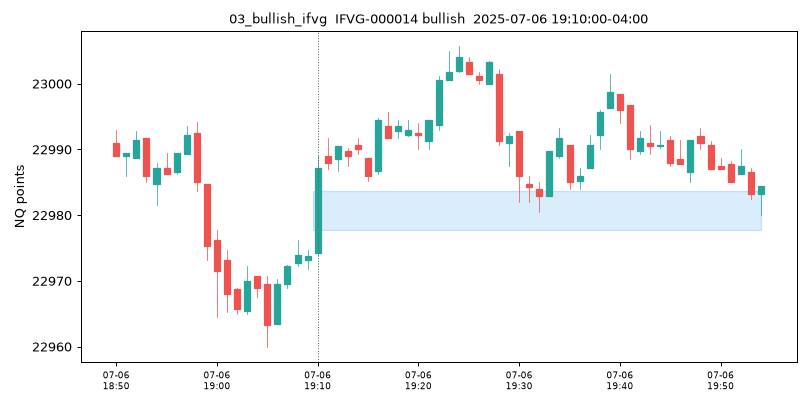

## 04_bearish_ifvg
- primitive_id: `IFVG-000013`  subtype: bearish  zone: [22983.50, 22986.75]
- timestamp (ET): 2025-07-06 18:59:00-04:00

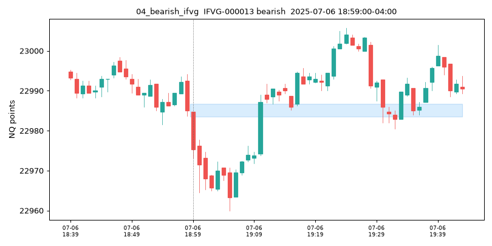

## 05_bullish_rb
- primitive_id: `RB-000002`  subtype: bullish  zone: [22986.00, 22989.00]
- timestamp (ET): 2025-07-06 18:51:00-04:00

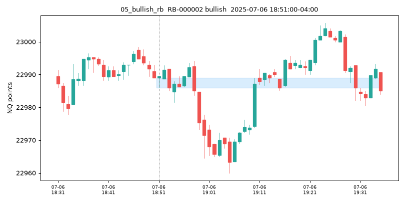

## 06_bearish_rb
- primitive_id: `RB-000005`  subtype: bearish  zone: [23001.75, 23005.00]
- timestamp (ET): 2025-07-06 19:23:00-04:00

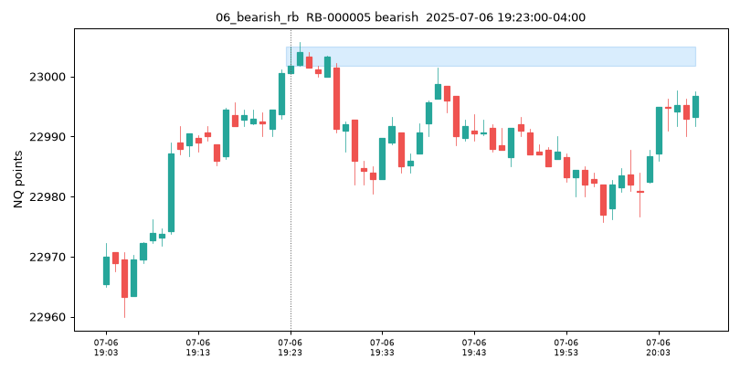

## 07_good_displacement
- primitive_id: `DISP-000007`  subtype: good  zone: [22985.00, 22991.75]
- timestamp (ET): 2025-07-06 18:53:00-04:00

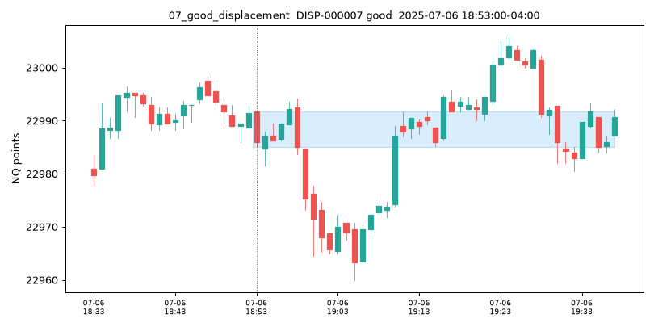

## 08_bad_displacement
- primitive_id: `DISP-000012`  subtype: bad  zone: [22964.50, 22977.75]
- timestamp (ET): 2025-07-06 19:00:00-04:00

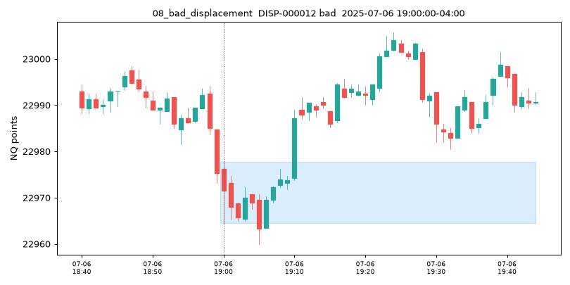

## 09_fvg_formation_continuation
- setup_id: `SETUP-000003`  long  mode: formation_close  (continuation)
- timestamp (ET): 2025-07-06 19:17:00-04:00
- graph: `fvg:bullish:formed -> formation_close -> continuation`
- primitive_ids: ['FVG-000021']
- entry 22991.75 | stop 22988.25 | natural target 22994.25 | natural RR 0.714
- executed target 22994.25 | executed RR 0.714 | expiry 120_bars_or_segment_end
- **outcome (separate/diagnostic): WIN**

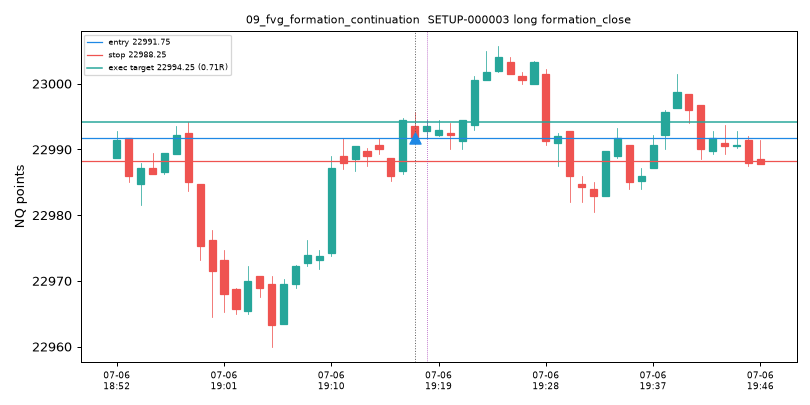

## 10_fvg_fill_continuation
- setup_id: `SETUP-000757`  short  mode: first_touch  (continuation)
- timestamp (ET): 2025-07-06 19:10:00-04:00
- graph: `fvg:bearish:formed -> first_touch -> continuation`
- primitive_ids: ['FVG-000017']
- entry 22984.75 | stop 22989.75 | natural target 22981.50 | natural RR 0.650
- executed target 22981.50 | executed RR 0.650 | expiry 120_bars_or_segment_end
- **outcome (separate/diagnostic): LOSS**

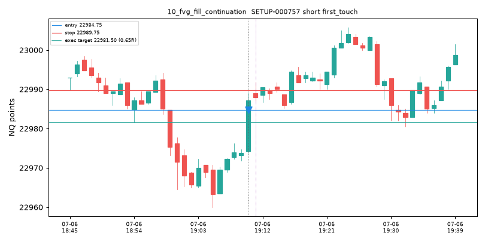

## 11_ifvg_immediate
- setup_id: `SETUP-001533`  short  mode: formation_close  (fade)
- timestamp (ET): 2025-07-06 19:49:00-04:00
- graph: `ifvg:bearish:formation_close (from FVG-000028)`
- primitive_ids: ['IFVG-000025', 'FVG-000028']
- entry 22987.00 | stop 22990.50 | natural target 22985.25 | natural RR 0.500
- executed target 22985.25 | executed RR 0.500 | expiry 120_bars_or_segment_end
- **outcome (separate/diagnostic): WIN**

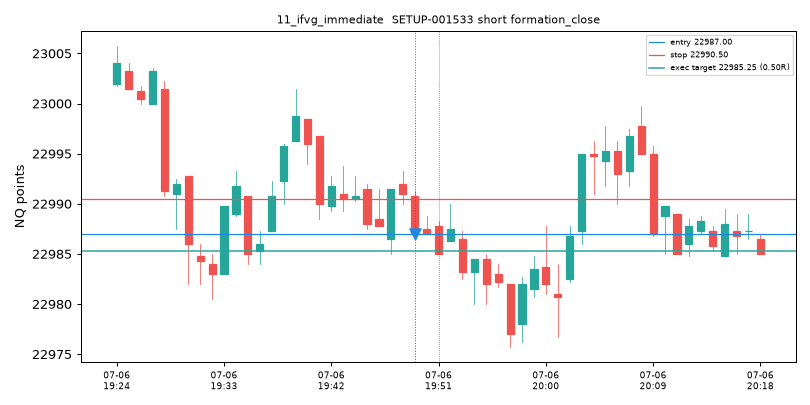

## 12_ifvg_retest
- setup_id: `SETUP-002203`  short  mode: retest  (fade)
- timestamp (ET): 2025-07-06 19:10:00-04:00
- graph: `ifvg:bearish:retest (from FVG-000011)`
- primitive_ids: ['IFVG-000013', 'FVG-000011']
- entry 22983.50 | stop 22987.25 | natural target 22981.50 | natural RR 0.533
- executed target 22981.50 | executed RR 0.533 | expiry 120_bars_or_segment_end
- **outcome (separate/diagnostic): LOSS**

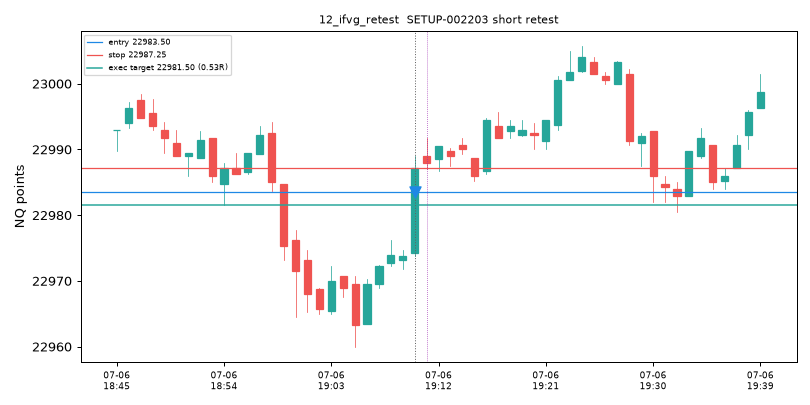

## 13_time_anchor_no_fvg
- setup_id: `SETUP-003934`  short  mode: retest  (continuation)
- timestamp (ET): 2025-07-06 20:22:00-04:00
- graph: `time_anchor:asia_open:break -> accept -> retest -> continuation`
- primitive_ids: ['LVL-000001']
- entry 22983.75 | stop 22985.25 | natural target 22981.50 | natural RR 1.500
- executed target 22982.25 | executed RR 1.000 | expiry 120_bars_or_segment_end
- **outcome (separate/diagnostic): WIN**

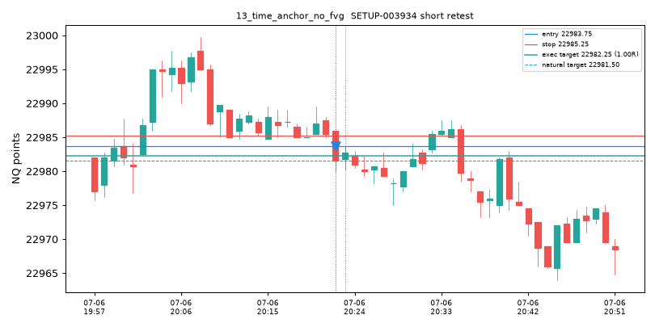

## 14_hist_level_continuation
- setup_id: `SETUP-004148`  short  mode: retest  (continuation)
- timestamp (ET): 2025-07-07 09:52:00-04:00
- graph: `hist_level:hl_0930_high:break -> accept -> retest -> continuation`
- primitive_ids: ['LVL-000009']
- entry 22975.75 | stop 22977.25 | natural target 22975.00 | natural RR 0.500
- executed target 22975.00 | executed RR 0.500 | expiry 120_bars_or_segment_end
- **outcome (separate/diagnostic): WIN**

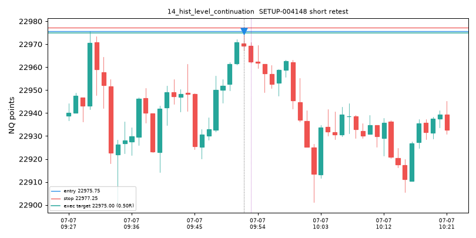

## 15_hist_level_fade
- setup_id: `SETUP-004159`  short  mode: formation_close  (fade)
- timestamp (ET): 2025-07-08 02:16:00-04:00
- graph: `hist_level:hl_0930_low:sweep -> reject -> fade`
- primitive_ids: ['LVL-000010']
- entry 22940.25 | stop 22942.50 | natural target 22939.00 | natural RR 0.556
- executed target 22939.00 | executed RR 0.556 | expiry 120_bars_or_segment_end
- **outcome (separate/diagnostic): LOSS**

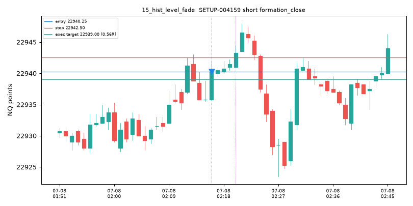

## 16_vwap_continuation
- setup_id: `SETUP-041469`  short  mode: first_touch  (continuation)
- timestamp (ET): 2025-07-06 18:11:00-04:00
- graph: `vwap:bounce -> continuation`
- primitive_ids: ['VWAP-000001']
- entry 22992.25 | stop 23003.75 | natural target 22977.00 | natural RR 1.326
- executed target 22980.75 | executed RR 1.000 | expiry 120_bars_or_segment_end
- **outcome (separate/diagnostic): LOSS**

## 17_vwap_fade
- setup_id: `SETUP-041466`  short  mode: formation_close  (fade)
- timestamp (ET): 2025-07-06 18:05:00-04:00
- graph: `vwap:band_reject_+1.618 -> fade_to_vwap`
- primitive_ids: ['VWAP-000001']
- entry 23008.50 | stop 23011.50 | natural target 22993.34 | natural RR 5.053
- executed target 23005.50 | executed RR 1.000 | expiry 120_bars_or_segment_end
- **outcome (separate/diagnostic): WIN**

## 18_compression_to_expansion
- setup_id: `SETUP-042597`  short  mode: next_bar  (continuation)
- timestamp (ET): 2025-07-07 01:20:00-04:00
- graph: `compression -> expansion -> continuation`
- primitive_ids: ['STRUCT-000006']
- entry 22934.00 | stop 22942.50 | natural target 22914.50 | natural RR 2.294
- executed target 22925.50 | executed RR 1.000 | expiry 120_bars_or_segment_end
- **outcome (separate/diagnostic): LOSS**

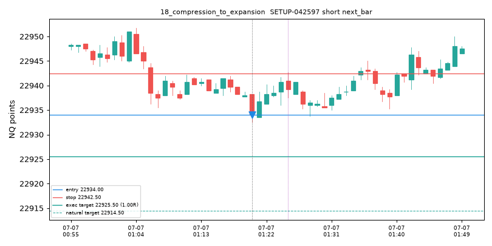

## 19_capped_1R
- setup_id: `SETUP-041466`  short  mode: formation_close  (fade)
- timestamp (ET): 2025-07-06 18:05:00-04:00
- graph: `vwap:band_reject_+1.618 -> fade_to_vwap`
- primitive_ids: ['VWAP-000001']
- entry 23008.50 | stop 23011.50 | natural target 22993.34 | natural RR 5.053
- executed target 23005.50 | executed RR 1.000 | expiry 120_bars_or_segment_end
- **outcome (separate/diagnostic): WIN**

## 20_natural_half_to_1R
- setup_id: `SETUP-041467`  short  mode: formation_close  (fade)
- timestamp (ET): 2025-07-06 18:06:00-04:00
- graph: `vwap:band_reject_+1.618 -> fade_to_vwap`
- primitive_ids: ['VWAP-000001']
- entry 23000.00 | stop 23011.50 | natural target 22993.75 | natural RR 0.543
- executed target 22993.75 | executed RR 0.543 | expiry 120_bars_or_segment_end
- **outcome (separate/diagnostic): AMBIGUOUS**

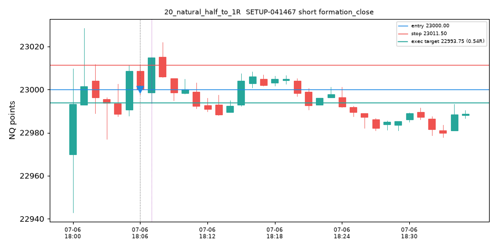

## 21_rejected_below_half_R
- setup_id: `SETUP-041464`  short  mode: formation_close  (fade)
- timestamp (ET): 2025-07-06 18:01:00-04:00
- graph: `vwap:band_reject_+1.618 -> fade_to_vwap`
- primitive_ids: ['VWAP-000001']
- entry 23001.50 | stop 23029.00 | natural target 22991.97 | natural RR 0.346
- executed target 0.00 | executed RR 0.000 | expiry 120_bars_or_segment_end
- **outcome (separate/diagnostic): UNEVALUATED**

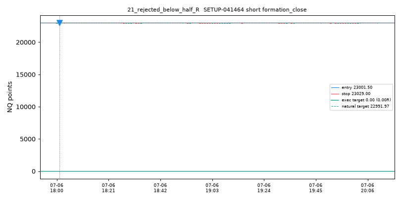

## 22_continuation_setup
- setup_id: `SETUP-041469`  short  mode: first_touch  (continuation)
- timestamp (ET): 2025-07-06 18:11:00-04:00
- graph: `vwap:bounce -> continuation`
- primitive_ids: ['VWAP-000001']
- entry 22992.25 | stop 23003.75 | natural target 22977.00 | natural RR 1.326
- executed target 22980.75 | executed RR 1.000 | expiry 120_bars_or_segment_end
- **outcome (separate/diagnostic): LOSS**

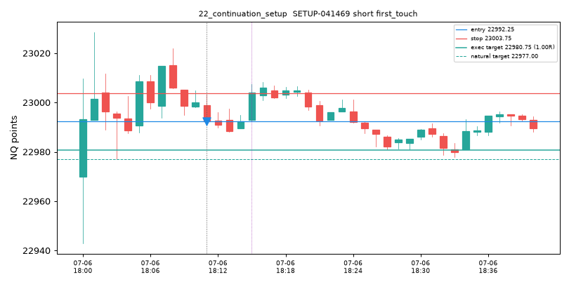

## 23_fade_setup
- setup_id: `SETUP-041466`  short  mode: formation_close  (fade)
- timestamp (ET): 2025-07-06 18:05:00-04:00
- graph: `vwap:band_reject_+1.618 -> fade_to_vwap`
- primitive_ids: ['VWAP-000001']
- entry 23008.50 | stop 23011.50 | natural target 22993.34 | natural RR 5.053
- executed target 23005.50 | executed RR 1.000 | expiry 120_bars_or_segment_end
- **outcome (separate/diagnostic): WIN**

## 24_no_fvg_no_ifvg
- setup_id: `SETUP-041466`  short  mode: formation_close  (fade)
- timestamp (ET): 2025-07-06 18:05:00-04:00
- graph: `vwap:band_reject_+1.618 -> fade_to_vwap`
- primitive_ids: ['VWAP-000001']
- entry 23008.50 | stop 23011.50 | natural target 22993.34 | natural RR 5.053
- executed target 23005.50 | executed RR 1.000 | expiry 120_bars_or_segment_end
- **outcome (separate/diagnostic): WIN**

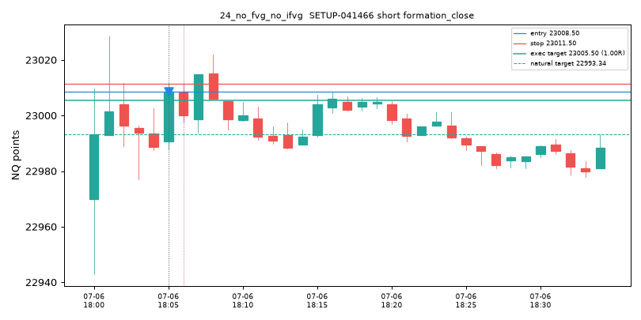

## 25_no_liquidity_sweep
- setup_id: `SETUP-041466`  short  mode: formation_close  (fade)
- timestamp (ET): 2025-07-06 18:05:00-04:00
- graph: `vwap:band_reject_+1.618 -> fade_to_vwap`
- primitive_ids: ['VWAP-000001']
- entry 23008.50 | stop 23011.50 | natural target 22993.34 | natural RR 5.053
- executed target 23005.50 | executed RR 1.000 | expiry 120_bars_or_segment_end
- **outcome (separate/diagnostic): WIN**

