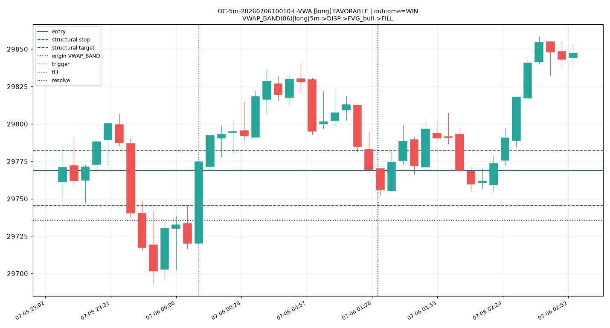
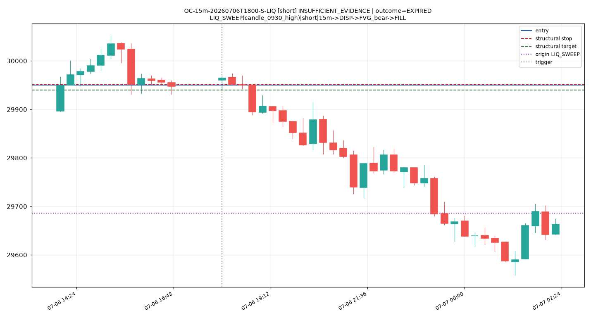
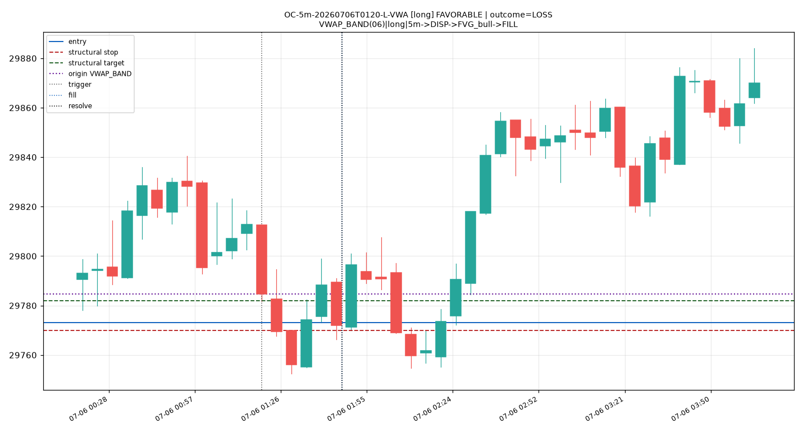
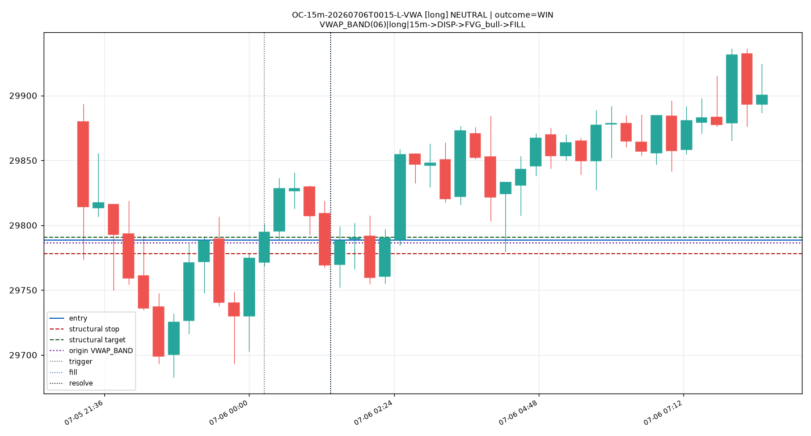
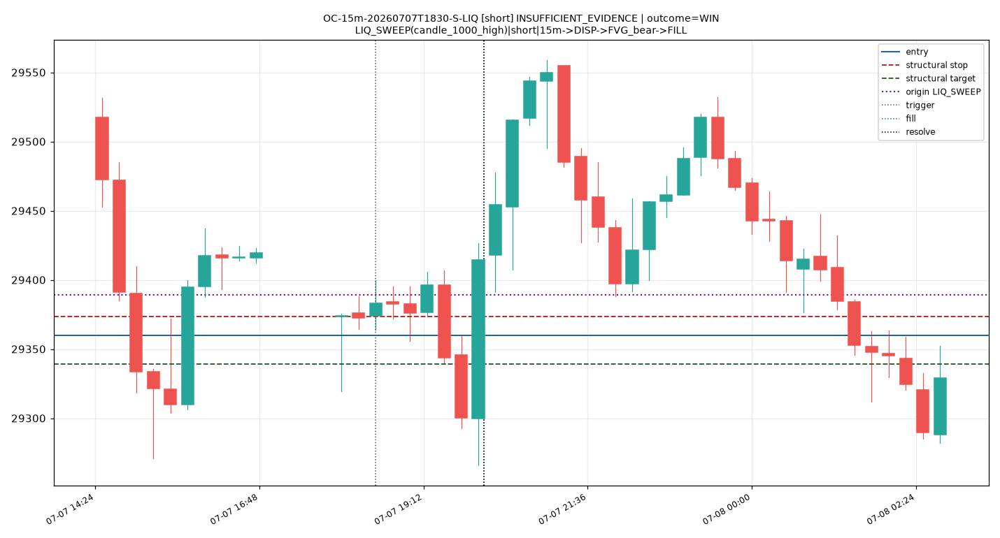
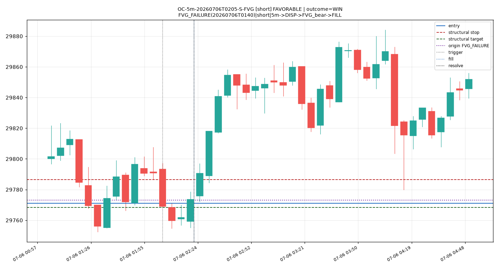

# Phase 2 — Recognizer Review Pack (front page)

_Observational prototype. Structural score, learned evidence, predicted class and realized outcome are separate fields. No edge claimed; one July week proves nothing._

## Primitive examples (canonical Phase-1 ledgers)

| kind | reference chart |
|---|---|
| valid rejection block | `../../outputs/charts/rejblock_bull_example.png` |
| good displacement | `../../outputs/charts/disp_high.png` |
| bad displacement | `../../outputs/charts/disp_low.png` |
| valid FVG | `../../outputs/charts/fvg_5m_bull.png` |
| valid iFVG | `../../outputs/charts/ifvg_bull.png` |

## Predicted-setup examples (frozen before outcome)

## FAVORABLE

### OC-5m-20260706T0010-L-VWA  ·  FAVORABLE
- trigger 2026-07-06 00:10 ET · dir **long** · tf 5m
- graph (exact): `VWAP_BAND(06)|long|5m->DISP->FVG_bull->FILL`
- graph (reduced): `ORIGIN_VWAP_BAND|long|5m->DISPLACEMENT->FVG_RETEST`
- primitives: ORIGIN:VWAP-1.618-2026-07-06 ; TRIGGER_FVG:FVG-5m-bull-20260706T0015
- context (<=3): origin=VWAP_BAND | anchor=off_anchor | vwap_below
- **structural score** 70.462 (disp 0.7646, trig 0.8138, target 0.1825)
- prev-session evidence (reduced family): 1s n=4 fav=1.0; 3s n=17 fav=0.9412; 5s n=19 fav=0.9474; 10s n=52 fav=0.9038; 20s n=66 fav=0.9242
- exact-graph evidence: n=0 fav=nan | reduced n=66 fav=0.9242
- **shrunk expected R** 0.3275 · shrunk fav prob 0.9099 · ESS 66.0 · evidence_count 0.0 · uncertainty ±0.0691
- **predicted class (frozen before outcome): FAVORABLE**
- entry 29769.0 · stop 29745.25 · target 29782.0 (level) · expiry E=20 bars
- **realized outcome (separate): WIN** · realized R 0.5473684210526316 · MFE 0.547R MAE 0.053R

## ADVERSE / INSUFFICIENT_EVIDENCE

### OC-15m-20260706T1800-S-LIQ  ·  INSUFFICIENT_EVIDENCE
- trigger 2026-07-06 18:00 ET · dir **short** · tf 15m
- graph (exact): `LIQ_SWEEP(candle_0930_high)|short|15m->DISP->FVG_bear->FILL`
- graph (reduced): `ORIGIN_LIQ_SWEEP|short|15m->DISPLACEMENT->FVG_RETEST`
- primitives: ORIGIN:LVL-6-2026-07-07-candle_0930_high ; TRIGGER_FVG:FVG-15m-bear-20260706T1845
- context (<=3): origin=LIQ_SWEEP | anchor=asia_open | vwap_below
- **structural score** 61.917 (disp 0.8217, trig 0.0, target 1.0)
- prev-session evidence (reduced family): 1s n=1 fav=1.0; 3s n=3 fav=0.6667; 5s n=5 fav=0.8; 10s n=7 fav=0.7143; 20s n=7 fav=0.7143
- exact-graph evidence: n=1 fav=1.0 | reduced n=7 fav=0.7143
- **shrunk expected R** 0.6639 · shrunk fav prob 0.781 · ESS 7.0 · evidence_count 1.0 · uncertainty ±0.3064
- **predicted class (frozen before outcome): INSUFFICIENT_EVIDENCE**
- entry 29950.25 · stop 29950.75 · target 29939.75 (level) · expiry E=20 bars
- **realized outcome (separate): EXPIRED** · realized R nan · MFE nanR MAE nanR

## FAVORABLE that LOST

### OC-5m-20260706T0120-L-VWA  ·  FAVORABLE
- trigger 2026-07-06 01:20 ET · dir **long** · tf 5m
- graph (exact): `VWAP_BAND(06)|long|5m->DISP->FVG_bull->FILL`
- graph (reduced): `ORIGIN_VWAP_BAND|long|5m->DISPLACEMENT->FVG_RETEST`
- primitives: ORIGIN:VWAP-1.0-2026-07-06 ; TRIGGER_FVG:FVG-5m-bull-20260706T0140
- context (<=3): origin=VWAP_BAND | anchor=off_anchor | vwap_below
- **structural score** 64.77 (disp 0.3727, trig 0.5999, target 1.0)
- prev-session evidence (reduced family): 1s n=4 fav=1.0; 3s n=17 fav=0.9412; 5s n=19 fav=0.9474; 10s n=52 fav=0.9038; 20s n=66 fav=0.9242
- exact-graph evidence: n=0 fav=nan | reduced n=66 fav=0.9242
- **shrunk expected R** 0.3275 · shrunk fav prob 0.9099 · ESS 66.0 · evidence_count 0.0 · uncertainty ±0.0691
- **predicted class (frozen before outcome): FAVORABLE**
- entry 29773.0 · stop 29770.0 · target 29782.0 (level) · expiry E=20 bars
- **realized outcome (separate): LOSS** · realized R -1.0 · MFE 2.583R MAE 2.0R

## weakly-predicted (NEUTRAL) that WON

### OC-15m-20260706T0015-L-VWA  ·  NEUTRAL
- trigger 2026-07-06 00:15 ET · dir **long** · tf 15m
- graph (exact): `VWAP_BAND(06)|long|15m->DISP->FVG_bull->FILL`
- graph (reduced): `ORIGIN_VWAP_BAND|long|15m->DISPLACEMENT->FVG_RETEST`
- primitives: ORIGIN:VWAP-1.0-2026-07-06 ; TRIGGER_FVG:FVG-15m-bull-20260706T0030
- context (<=3): origin=VWAP_BAND | anchor=off_anchor | vwap_below
- **structural score** 63.208 (disp 0.818, trig 0.7143, target 0.0714)
- prev-session evidence (reduced family): 1s n=7 fav=1.0; 3s n=14 fav=0.7857; 5s n=29 fav=0.8966; 10s n=45 fav=0.8444; 20s n=45 fav=0.8444
- exact-graph evidence: n=0 fav=nan | reduced n=45 fav=0.8444
- **shrunk expected R** 0.085 · shrunk fav prob 0.8501 · ESS 45.0 · evidence_count 0.0 · uncertainty ±0.1043
- **predicted class (frozen before outcome): NEUTRAL**
- entry 29788.5 · stop 29778.0 · target 29790.75 (level) · expiry E=20 bars
- **realized outcome (separate): WIN** · realized R 0.2142857142857142 · MFE 1.452R MAE 0.119R

## structurally strong but INSUFFICIENT_EVIDENCE

### OC-15m-20260707T1830-S-LIQ  ·  INSUFFICIENT_EVIDENCE
- trigger 2026-07-07 18:30 ET · dir **short** · tf 15m
- graph (exact): `LIQ_SWEEP(candle_1000_high)|short|15m->DISP->FVG_bear->FILL`
- graph (reduced): `ORIGIN_LIQ_SWEEP|short|15m->DISPLACEMENT->FVG_RETEST`
- primitives: ORIGIN:LVL-6-2026-07-08-candle_1000_high ; TRIGGER_FVG:FVG-15m-bear-20260707T1945
- context (<=3): origin=LIQ_SWEEP | anchor=off_anchor | vwap_below
- **structural score** 74.125 (disp 0.7276, trig 0.9057, target 0.494)
- prev-session evidence (reduced family): 1s n=1 fav=1.0; 3s n=3 fav=0.6667; 5s n=5 fav=0.8; 10s n=7 fav=0.7143; 20s n=7 fav=0.7143
- exact-graph evidence: n=2 fav=0.5 | reduced n=7 fav=0.7143
- **shrunk expected R** 0.5065 · shrunk fav prob 0.7141 · ESS 7.0 · evidence_count 2.0 · uncertainty ±0.3347
- **predicted class (frozen before outcome): INSUFFICIENT_EVIDENCE**
- entry 29359.75 · stop 29373.75 · target 29339.0 (level) · expiry E=20 bars
- **realized outcome (separate): WIN** · realized R 1.4821428571428572 · MFE 1.946R MAE 0.321R

## genuinely new graph candidate (no prior exact-graph evidence)

### OC-5m-20260706T0205-S-FVG  ·  FAVORABLE
- trigger 2026-07-06 02:05 ET · dir **short** · tf 5m
- graph (exact): `FVG_FAILURE(20260706T0140)|short|5m->DISP->FVG_bear->FILL`
- graph (reduced): `ORIGIN_FVG_FAILURE|short|5m->DISPLACEMENT->FVG_RETEST`
- primitives: ORIGIN:FVG-5m-bull-20260706T0140 ; TRIGGER_FVG:FVG-5m-bear-20260706T0210
- context (<=3): origin=FVG_FAILURE | anchor=off_anchor | vwap_below
- **structural score** 65.746 (disp 0.6633, trig 0.8551, target 0.0591)
- prev-session evidence (reduced family): 1s n=4 fav=0.5; 3s n=30 fav=0.7; 5s n=54 fav=0.7222; 10s n=124 fav=0.7016; 20s n=163 fav=0.7239
- exact-graph evidence: n=0 fav=nan | reduced n=163 fav=0.7239
- **shrunk expected R** 0.2286 · shrunk fav prob 0.7257 · ESS 163.0 · evidence_count 0.0 · uncertainty ±0.0685
- **predicted class (frozen before outcome): FAVORABLE**
- entry 29771.0 · stop 29786.5 · target 29768.25 (level) · expiry E=20 bars
- **realized outcome (separate): WIN** · realized R 0.1774193548387097 · MFE 0.548R MAE 0.161R

